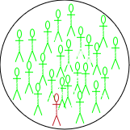
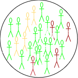
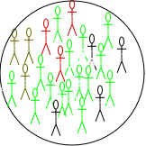
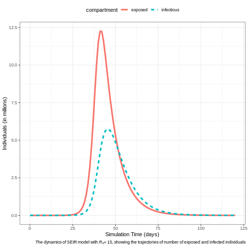
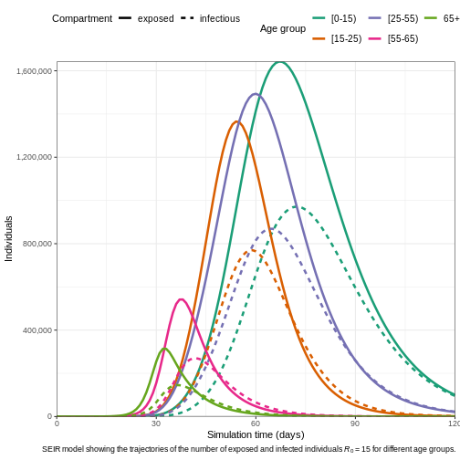
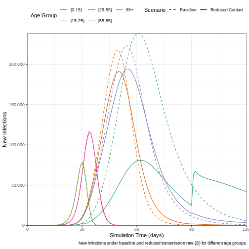
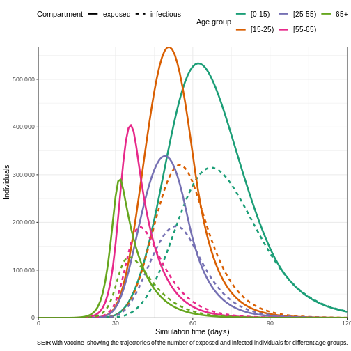
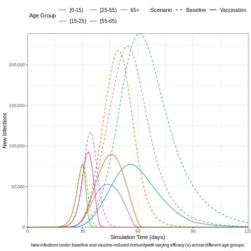
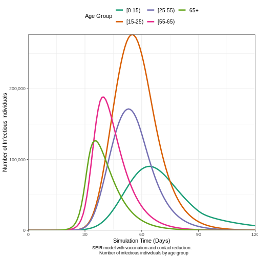

# Preface

This document is prepared for the participants of the Outbreak Analytics in R course, 
organized by the Epiverse-TRACE team. Its purpose is to provide a concise 
introduction to the mathematical theory behind modeling infectious epidemics. 
We will use the Susceptible, Exposed, Infected, and Recovered (**SEIR**) model, 
applicable to diseases like measles, mumps, rubella, as an example.

# Scenario

Suppose a new infection has been detected in a closed community of
$\mathbf{N}$ individuals, with the infection diagnosed in a single
individual. The remaining $\mathbf{N-1}$ individuals are all at risk of
getting the infection and are considered susceptible ($\mathbf{S}$). An
infected person  makes $k$ contacts and have a probability $p$ of infecting 
each one if susceptible, and we can call this $\beta$ for short. This represents the average rate at which
an infected individual can transmit the infection to a susceptible
individual.

Depending on the nature of the disease, a newly infected individual may take 
time to show symptoms, known as the incubation period (time from infection to 
symptoms), and time to become infectious, known as the latent period (time from 
infection to infectiousness). The latent period is relevant to the SEIR-type models. 
Susceptible individuals who come into contact with an infected
person and acquire the infection first move to an intermediate state
called exposed ($\mathbf{E}$). There they spend, on average,
$\frac{1}{\alpha}$ units of time (the latent period) and then move to
the infected class ($\mathbf{I}$) at a constant rate $\alpha$. Infected
individuals are removed (either by recovery or death) from $I$ at a
constant rate $\gamma$, with $\frac{1}{\gamma}$ representing the average
recovery duration. Upon recovery, they gain lifelong immunity against
the current infection, meaning they do not become susceptible again, and
they move to the recovered class ($\mathbf{R}$) (see
[Figure 1](#fig-seir)). These are some assumptions for modelling purposes and 
may not particularly reflect the biological underlying processes.  

{ref-parent="fig-seir"}
{ref-parent="fig-seir"}
{ref-parent="fig-seir"}
{ref-parent="fig-seir"}

The four S-E-I-R classes considered in the $\mathbf{SEIR}$ model.
 The number of individuals in each 
 change overtime and thus are functions of time $t$, and
the total population at any time $t$ is
$N(t)=  S(t) + E(t) + I(t)+ R(t)$. The rates of change between these
classes are captured mathematically through four differential equations
as follows:

[$$
\begin{eqnarray} 
\frac{dS}{dt} &=& -\beta \frac{S.I}{N} & & \\
\frac{dE}{dt} &=&\beta \frac{S.I}{N} &-& \alpha E\\
\frac{dI}{dt} &=& \alpha E &-& \gamma I \\
\frac{dR}{dt} &=& \gamma I  & &\\ 
\end{eqnarray}
 \qquad(1)$$]{#eq-s1}

At time $t_0=0$, we assume there is one infected person ($\mathbf{I}_0 =1$); 
no exposed ($\mathbf{E}_0 = 0$) or recovery ($\mathbf{R}_0 = 0$). and while
all other individuals remain susceptible
($\mathbf{S}_0= \mathbf{N} -\mathbf{I}_0 = \mathbf{N} -1$). These are known as the initial values of the system
in [Equation 1](#eq-s1).

 Since the compartments represent individuals, their
values must always be non-negative. This characteristic is referred to
as the positivity of the solution. 
Before delving into mathematical details of how to solve
[Equation 1](#eq-s1), a few key observations can be made:

1. At the onset of an epidemic, the number of susceptible individuals
    begins to decrease exponentially, while the number of exposed and
    infectious individuals increases. As the epidemic progresses, the
    susceptible population becomes depleted, and the exposed and
    infectious groups reach their peak before starting to decline.
    Meanwhile, the number of recovered individuals continues to increase
    without decreasing. (Note that these observations  hold true only when
$\mathcal{R}_0 > 1$, as we shall see later in this document).

2.  The infection will start spreading in the community only when $\frac{\mathbf{dE}}{dt} > 0$
    or $\frac{\mathbf{dI}}{dt} > 0$, and taking the values of these two
    terms from [Equation 1](#eq-s1) leads to

[$$
\begin{eqnarray} 
\beta .\frac{S.I}{N} &-& \alpha .E > 0\\
 \alpha. E &-& \gamma .I > 0.
\end{eqnarray} 
 \qquad(2)$$]{#eq-s2} Adding the two equations in
[Equation 2](#eq-s2), gives
$\frac{\beta}{\gamma} > \frac{\mathbf{N}}{\mathbf{S}}$. At time $t=0$,
we have $\mathbf{S} = \mathbf{N}-1 \approx  \mathbf{N}$. Therefore, the
infection will take off if $\frac{\beta}{\gamma} > 1$. This is a very
interesting observation -- It tells that the epidemic increases if new infections
are generated at a higher rate than existing infections recover.

3.  The ratio $\frac{\beta}{\gamma}$ represents the basic reproduction
    number, $\mathcal{R}_0$, which is defined as the average number of
    new infections caused by a single infected individual in a fully
    susceptible population. Intuitively, $\beta$ alone only describes the rate 
    of new infections, without considering how long each infected individual 
    contributes to transmission. By accounting for the infectious period 
    $\frac{1}{\gamma}$, we obtain a complete measure of each infected 
    individual's impact on transmission over their entire infectious duration. $\mathcal{R}_0$ is a crucial metric for
    understanding the transmissibility of an infectious disease. A
    higher value of $\mathcal{R}_0$ indicates a more transmissible
    disease.

4.  The final size of an epidemic—the total number of individuals who will 
ultimately be infected—is  the cumulative count of infections as 
predicted by the model. However, If only the  $\mathcal{R}_0$  is known, it 
can still provide insights into the outbreak's final size through 
the following equation:
[$$
    \begin{equation}
    z = 1 - e^{-\mathcal{R}_0 .z}
    \end{equation}
     \qquad(3)$$]{#eq-fs}

Where:

-   $z$ is the final size (the fraction of the population infected),

-   $\mathcal{R}_0$ is the basic reproduction number, and

-   $e$ is the base of the natural logarithm.

For a detailed derivation and theoretical background on the final size equation,
 please refer to [this article](https://epiverse-trace.github.io/finalsize/articles/theoretical_background.html).

5.  Additionally, the basic reproduction number $\mathcal{R}_0$ is
    crucial for determining the herd immunity threshold (HIT), which
    represents the minimum proportion of the population that must be
    immune (either through vaccination or previous infection) in order
    to contain the epidemic and prevent widespread transmission. The
    formula for the herd immunity threshold is:
    [$$ HIT = 1 - \frac{1}{\mathcal{R}_0} \qquad(4)$$]{#eq-hit}

Where:

-   HIT is the proportion of the population that needs to be immune to
    achieve herd immunity,

As $\mathcal{R}_0$ increases, the herd immunity threshold also
increases, meaning a larger proportion of the population must be immune
to prevent the epidemic from spreading.

To understand the logic behind the HIT formula, note that as time passes, 
immunity builds up in the population. This reduces the number of susceptible 
individuals, thereby decreasing the actual number of secondary cases that a 
typical infected person can produce. This number is called the effective 
reproduction number  ($\mathcal{R}_{eff}$), and it is given as:
$$ \mathcal{R}_{eff} = \mathcal{R}_0 \times \mathbf{S}.$$

For an epidemic to stop spreading, each infected person must, on average, 
infect fewer than one other person—meaning we need $\mathcal{R}<1$. 
This condition leads to:
$$\mathbf{S} < \frac{1}{\mathcal{R}_0}$$

Thus, if we can reduce the susceptible proportion $\mathbf{S}$ below 
$\frac{1}{\mathcal{R}_0}$ the effective reproduction number $\mathcal{R}_{eff}$ 
will drop below 1, causing the epidemic to stop growing on average.

# Measles Outbreak in Burkina Faso

## Background

Measles is a highly contagious viral disease that spreads quickly,
particularly in environments where people live or gather in close
quarters, such as schools, healthcare facilities, or densely populated
urban areas. Transmission occurs through respiratory droplets when an
infected person coughs or sneezes, and the virus can remain viable in
the air for up to two hours. Effective vaccines are available, offering
an efficacy of 93% to 97% ([About Measles, CDC](https://www.cdc.gov/measles/about/index.html)), making vaccination a key tool in controlling
measles outbreaks.

Given the virus's high transmissibility, even a single introduced case of measles
can trigger large outbreaks, especially in regions with low vaccination
coverage. The latent (pre-infectious) period for measles is
typically around 8 days, while the infectious period averages 5 days ([Masters et al., 2023](https://www.thelancet.com/journals/lanpub/article/PIIS2468-2667(23)00130-5/fulltext)). The SEIR model in
[Equation 1](#eq-s1) can e employed to simulate the
dynamics of measles outbreaks and evaluate control measures like
vaccination.

## Burkina Faso Situation in Jan 2024

Burkina Faso faces recurring
measles outbreaks. This can be attributed to factors such as limited
healthcare access, inadequate vaccination coverage, and fragile
healthcare systems. In 2023, Burkina Faso experienced a particularly
severe outbreak, with over 2,000 suspected cases reported 
([Crisis24, 2024](https://crisis24.garda.com/alerts/2024/02/burkina-faso-elevated-measles-activity-reported-in-multiple-areas-in-february)),
prompting health authorities and international organizations to scale up
vaccination campaigns in an effort to curtail the spread of the disease 
([Save the Children, 2024](https://www.savethechildren.net/news/burkina-faso-over-2000-children-diagnosed-suspected-measles-nationwide-outbreak); [The Cable, 2024](https://www.thecable.ng/burkina-faso-records-2000-suspected-cases-as-country-battles-measles-outbreak/)).

We will simulate the measles outbreak in Burkina Faso using the SEIR
model in [Equation 1](#eq-s1). This will allow us to
explore the outbreak dynamics with and without interventions. For this
purpose, we will use the **R** package `{epidemics}`, which is designed
for modeling infectious disease spread. In these simulations, we will focus 
specifically on the number of infections, which represents a subset of the total reported suspected cases.

## Baseline Model

**Model Assumptions and Parameters**

1.  **Total Population**: The population of Burkina Faso is
    approximately $N\approx 22.67$ million.

2.  **Population Structure**:

    -   **No Age Stratification**: Assume the population is homogeneous
        with respect to age. This means that all individuals, regardless
        of age, have the same susceptibility to measles and contribute
        equally to the transmission dynamics.

3.  **Initial Conditions**:

    -   A single infectious case is introduced into the population:
        $I_0 = 1$.
    -   The entire population, except for this one case, is initially 
    susceptible: $S_0 = N - 1$. This 
    assumption simplifies the model and allows us to explore the spread of 
    infection in the absence of immunity. Although real populations typically 
    have some immunity due to vaccination or prior infection.
    -   No individuals are in the exposed stage at the start: $E_0 = 0$.
    -   No individuals have recovered: $R_0 = 0$.

4.  **latent Period**: The average latent period for measles is
    around 8 days (the time period between exposure and becoming
    infectious), so the transition rate from exposed to infectious
    individuals is: $\alpha = \frac{1}{8}$.

5.  **Infectious Period**: The average infectious period lasts for 5
    days, which means the recovery rate is: $\gamma = \frac{1}{5}$.

6.  **Basic Reproduction Number** $\mathcal{R}_0$:

    -   $\mathcal{R}_0 =15$. For measles this value typically ranges
        from 12 to 18, or even more [Fiona, et al](https://www.thelancet.com/journals/laninf/article/PIIS1473-3099(17)30307-9/abstract).
    -   This makes the transmission rate
        $\beta = \mathcal{R}_0 \gamma = 3$--meaning each infectious individual causes 3 new infections
        per day in a fully susceptible population.

By applying these assumptions and parameters to
[Equation 1](#eq-s1), we can simulate the potential
trajectory of the measles outbreak using the syntax provided by the
{epidemics} package as shown in the below is code chunk.


``` r
# Loading libraries
library(dplyr)
library(ggplot2)
library(epidemics)
```


``` r
# Define the population structure for Burkina Faso
bfaso <- epidemics::population(
  name = "Burkina Faso",
  contact_matrix = matrix(1), # Well-mixed population
  demography_vector = 22.67e6, # Population size
  # Initial conditions: Susceptible, exposed, Infectious, vaccinated, recovered
  initial_conditions = matrix(
    c(1 - 1 / 22.67e6, 1 / 22.67e6, 0, 0, 0),
    nrow = 1, ncol = 5
  )
)

# Run the SEIR model simulation
output <- epidemics::model_default(
  population = bfaso,
  transmission_rate = 15 / 5, # R0/infectious period = 15/5 = 3
  infectiousness_rate = 1 / 8, # 1/latent period (pre-infectious phase)
  recovery_rate = 1 / 5, # 1/infectious period
  time_end = 120, # Simulation over 120 days
  increment = 1 # Daily increments
)

# Plot the epidemic curve for susceptible, exposed, infectious, and recovered
output %>%
  filter(compartment %in% c("exposed", "infectious")) %>%
  ggplot(aes(
    x = time,
    y = value / 10^6, # Scale to millions
    col = compartment,
    linetype = compartment
  )) +
  geom_line(linewidth = 1.5) +
  theme_bw() +
  theme(
    legend.position = "top"
  ) +
  labs(
    x = "Simulation Time (days)",
    y = "Individuals (in millions)",
    caption = expression(
      paste(
        "The dynamics of SEIR model with ",
        italic(R)[0], "= 15, ",
        "showing the trajectories of number of exposed and infected individuals"
      )
    )
  )
```




## Expected Epidemic Size & Herd Immunity

The `{finalsize}` package implements
[Equation 3](#eq-fs) for calculate the expected proportion
of the population that will be infected given a specified basic
reproduction number $(\mathcal{R}_0)$. The calculation can be done as
follows:


``` r
finalsize::final_size(r0 = 10)
```

``` output
    demo_grp   susc_grp susceptibility p_infected
1 demo_grp_1 susc_grp_1              1  0.9999546
```

For $\mathcal{R}_0 \geq 10$, the results indicate that nearly the entire
population is expected to be infected by measles. The $HIT$ needed to
contains the epidemic is about $93\%$, using the formula given in
[Equation 4](#eq-hit).

# Age-Structured Model

The age structure of Burkina Faso is characteristic of a young
population, with a majority of the population being under 25 years old.
According to recent estimates ([United Nations, 2023](https://population.un.org/wpp/);
 [Central Intelligence Agency, 2023](https://www.cia.gov/the-world-factbook/countries/burkina-faso/); 
 [World Bank, 2023](https://data.worldbank.org/indicator/SP.POP.TOTL?locations=BF)), the age structure
is broken down as follows:


-   $[0\to15)$ years: \~ 44 (43-45)% of the population
-   $[15\to 25)$ years: \~19.5 (19-20)%
-   $[25\to 55)$ years: \~29 (28-30)%
-   $[55\to 65)$ years: \~5 (3-5)%
-   $65+$ years : \~2.5 (2-3)%


## **Contact Matrix**

A contact matrix typically consists of rows and columns representing
different age groups, where each cell indicates the average number of
contacts between individuals of the age group corresponding to that row
and column.

Although we do not have a direct access for contact matrix for Burkina
Faso, we can resort for a hypothetical contact matrix based on general
assumptions about high contact rates among younger populations and lower
rates among older age groups:

  -------------------------------------------------------------------------------------
                 **\[0-15)**   **\[15-25)**   **\[25-54)**   **\[55-65)**   **65+**
  -------------- ------------- -------------- -------------- -------------- -----------
  **\[0-15)**    20            10             5              2              1

  **\[15-25)**   10            15             10             4              2

  **\[25-55)**   5             10             15             6              3

  **\[55-65)**   2             4              6              10             5

  **$65+$**       1             2              3              5              10
  -------------------------------------------------------------------------------------

  : Table for a **hypothetical** mean contacts between different age
  groups in Burkina Faso population.


``` r
# Initial conditions: one in every 1 million is infected
bf_pop <- 22.67e6
contact_matrix <- matrix(
  c(
    20, 10, 5, 2, 1, # Contacts from 0-14 years
    10, 15, 10, 4, 2, # Contacts from 15-24 years
    5, 10, 15, 6, 3, # Contacts from 25-54 years
    2, 4, 6, 10, 5, # Contacts from 55-64 years
    1, 2, 3, 5, 10
  ), # Contacts from 65+ years
  nrow = 5, # Number of rows
  byrow = TRUE, # Fill the matrix by rows
  dimnames = list(
    c("[0-15)", "[15-25)", "[25-55)", "[55-65)", "65+"),
    c("[0-15)", "[15-25)", "[25-55)", "[55-65)", "65+")
  )
)
# Define the demography vector for Burkina Faso
demography_vector <- c(0.44, 0.195, 0.29, 0.05, 0.025) * bf_pop
names(demography_vector) <- rownames(contact_matrix)

demography_vector
```

``` output
 [0-15) [15-25) [25-55) [55-65)     65+ 
9974800 4420650 6574300 1133500  566750 
```


``` r
# scale the contact matrix so the largest eigenvalue is 1.0
# this is to ensure that the overall epidemic dynamics correctly reflect
# the assumed value of R0
contact_matrix <- contact_matrix / max(Re(eigen(contact_matrix)$values))

# divide each row of the contact matrix by the corresponding demography
# this reflects the assumption that each individual in group {j} make contacts
# at random with individuals in group {i}
contact_matrix <- contact_matrix / demography_vector

# Print the contact matrix
# contact_matrix

# Define the population structure for Burkina Faso
initial_i <- 1 / bf_pop
initial_conditions <- c(S = 1 - initial_i, E = 0, I = initial_i, R = 0, V = 0)

# Replicate initial conditions for all age groups
initial_conditions_matrix <- rbind(
  initial_conditions,
  initial_conditions,
  initial_conditions,
  initial_conditions,
  initial_conditions
)

rownames(initial_conditions_matrix) <- rownames(contact_matrix)

# Print the initial conditions
# initial_conditions_matrix

# Create the population object
bf_population <- epidemics::population(
  name = "Burkina Faso",
  contact_matrix = contact_matrix,
  demography_vector = demography_vector,
  initial_conditions = initial_conditions_matrix
)

# Print the population object
# bf_population
```


``` r
# Run the epidemic model
output1 <- epidemics::model_default(
  population = bf_population,
  transmission_rate = 15 / 5, # R0/infectious period = 15/5 = 3
  infectiousness_rate = 1 / 8, # 1/latent period (pre-infectious phase)
  recovery_rate = 1 / 5, # 1/infectious period
  time_end = 120, # Simulation over 120 days
  increment = 1 # Daily increments
)

# Plot the epidemic curve
output1 %>%
  filter(compartment %in% c("exposed", "infectious")) %>%
  ggplot(aes(
    x = time,
    y = value,
    col = demography_group,
    linetype = compartment
  )) +
  geom_line(linewidth = 1.2) +
  scale_y_continuous(labels = scales::comma) +
  scale_colour_brewer(palette = "Dark2", name = "Age group") +
  expand_limits(y = c(0, 500e3)) +
  coord_cartesian(expand = FALSE) +
  theme_bw() +
  theme(
    legend.position = "top",
    legend.text = element_text(size = 10, hjust = 0, lineheight = 121)
  ) +
  labs(
    x = "Simulation time (days)",
    linetype = "Compartment",
    y = "Individuals",
    caption =
      expression(
        paste(
          "SEIR model showing the trajectories of the number of ",
          "exposed and infected individuals ",
          italic(R)[0], " = 15 for different age groups."
        )
      )
  ) +
  guides(
    color = guide_legend(nrow = 2)
  )
```




## Effective Reproduction Number ($\mathcal{R}_{eff}$)

Age-structured models account for heterogeneous characteristics in the
population, such as:

-   Demographic differences in social contacts,
-   Variations in demographic distribution, and
-   Differences in susceptibility to infection.

These factors result in different $\mathcal{R}_0$ values for each age
group. The **effective reproduction number** $\mathcal{R}_{eff}$
represents the overall reproduction number across all age groups while
accounting for these differences. It is calculated using the following
formula:

[$$
\begin{equation}
\mathcal{R}_{eff} = \rho(C) \lambda \gamma 
\end{equation}
 \qquad(5)$$]{#eq-reff}

Where:

-   $\rho(C)$ is the **largest eigenvalue** of the contact matrix $C$,
    which is derived from the social contact patterns, scaled by the
    population distribution across different demographic and
    susceptibility groups.

-   $\lambda$ is the **force of infection**, which measures the rate at
    which susceptible individuals are infected. This is distinct from
    the effective transmission rate, often denoted as $\beta$.

-   $\gamma$ represents the **infectious period**, which is the average
    duration an individual remains infectious.

The `{finalsize}`package implements
[Equation 5](#eq-reff), and we can use it to calculate the
$\mathcal{R}_{eff}$ for our age-structured model, as follows:


``` r
r0 <- 15 #  basic reproduction number

# define the number of age and susceptibility groups
n_demo_grps <- length(demography_vector)
n_risk_grps <- 5

# In this example, risk varies across groups
susceptibility <- matrix(
  data = c(0.80, 0.5, 0.3, 0.2, 0.1), nrow = n_demo_grps, ncol = n_risk_grps
)

# risk does not vary within groups
p_susceptibility <- matrix(
  data = 1, nrow = n_demo_grps, ncol = n_risk_grps
)

# p_susceptibility rows must sum to 1.0
p_susceptibility <- p_susceptibility / rowSums(p_susceptibility)


reff <- finalsize::r_eff(
  r0 = r0,
  contact_matrix = contact_matrix,
  demography_vector = demography_vector,
  susceptibility = susceptibility,
  p_susceptibility = p_susceptibility
)

reff
```

``` output
[1] 8.529089
```


::: {.alert .alert-secondary}

### Question

$\mathcal{R}_{eff}$ vs $\mathcal{R}_0$: How different is the $\mathcal{R}_{eff}$ value from $\mathcal{R}_0$?
:::


$\mathcal{R}_{eff}$ more accurately reflects the transmission 
potential because it takes into account both the inherent transmissibility of the pathogen and the actual state of susceptibility in the population.

# Interventions models

Interventions against measles include prevention, control, and
treatment. Controlling its spread requires a combination of public
health measures, such as reducing contact (e.g., curfew and school closures in 
[Samoa](https://en.wikipedia.org/wiki/2019_Samoa_measles_outbreak)),
 and vaccination. In this section, we will simulate
the SEIR model with interventions using the `{epidemics}` package.

## Contacts Reduction Model

Reducing contact by a certain percentage impacts the
transmission rate. This reduction can be achieved through
measures such as quarantine, limiting public gatherings, and regular
screening in healthcare settings. To include such interventions in the
baseline SEIR model, the `{epidemics}` package provides an object called
`interventions`, which is added to the model definition as shown in the
code chunk below.
We assume that a school closure will reduce the frequency of contacts within and between different age groups. We assume that school closures will reduce the contact between school-aged children (aged 0-15) by 0.5 and will cause a small reduction (0.01) in the contact between adults (aged 15 and over).


``` r
reduced_contacts <- epidemics::intervention(
  name = "school closure",
  type = "contacts",
  time_begin = 30,
  time_end = 30 + 60,
  reduction = matrix(c(0.5, 0.01, 0.01, 0.01, 0.01))
)

# Run the epidemic model
output2 <- epidemics::model_default(
  population = bf_population,
  transmission_rate = 15 / 5, # R0/infectious period = 15/5 = 3
  infectiousness_rate = 1 / 8, # 1/latent period (pre-infectious phase)
  recovery_rate = 1 / 5, # 1/infectious period
  intervention = list(contacts = reduced_contacts),
  time_end = 120, # Number of days to simulate 
  increment = 1 # Daily increments
)
```


To examine the effect that implementing a reduction in contact has on
the daily number of new infections, we plot the results from the two
models.


``` r
# Extract new infections data for each scenario
data_baseline <- epidemics::new_infections(output1, by_group = TRUE)
data_reduced <- epidemics::new_infections(output2, by_group = TRUE)

# Assign scenario names
data_baseline$scenario <- "Baseline"
data_reduced$scenario <- "Reduced Contact"

# Combine the data from both scenarios
data_combined <- bind_rows(data_baseline, data_reduced)

# Plot new infections over time with scenario and demographic groups
ggplot(data_combined) +
  geom_line(
    aes(
      x = time, y = new_infections,
      col = demography_group, linetype = scenario
    )
  ) +
  # Set axis scaling and formatting
  scale_y_continuous(labels = scales::comma) +
  scale_linetype_manual(
    name = "Scenario",
    values = c(
      Baseline = "dashed",
      "Reduced Contact" = "solid"
    )
  ) +
  scale_colour_brewer(
    palette = "Dark2",
    name = "Age Group"
  ) +
  expand_limits(y = c(0, 1e3)) +
  coord_cartesian(expand = FALSE) +
  theme_bw() +
  theme(
    legend.position = "top"
  ) +
  labs(
    x = "Simulation Time (days)",
    y = "New Infections",
    linetype = "Scenario",
    caption =
      expression(
        paste(
          "New infections under baseline and reduced transmission rate (",
          beta,
          ") for different age groups."
        )
      )
  ) +
  # Adjust legend display to fit in two rows
  guides(
    color = guide_legend(nrow = 2)
  )
```



## Vaccination Model

An effective vaccine for measles exists, known as the measles, mumps,
and rubella (MMR) vaccine, and many countires, including 
[Burkina Faso](https://www.unicef.org/media/155306/file/Burkina-Faso-Humanitarian-SitRep-31-March-2024.pdf),
 incorporates it as part of their 
national immunization strategy. The effect of vaccination with
MMR vaccine varies slightly depending on the vaccination rate per age at which it is
administered and the number of doses received. For example, let us say the 2-doses MMR
vaccination rate is approximately $0.01$, $0.02$, $0.03$, $0.04$, and
$0.05$ for the age groups $[0\to 15)$, $[15\to 25)$, $[25\to 55)$,
$[55\to 65)$, and $65+$, respectively. The `{epidemics}` package enables
the incorporation of vaccination interventions into modeling, as
demonstrated in the code chunk below.


``` r
vaccinate_elders <- epidemics::vaccination(
  name = "Vaccination compaign",
  time_begin = matrix(30, nrow(contact_matrix)),
  time_end = matrix(90, nrow(contact_matrix)),
  nu = matrix(c(0.01, 0.02, 0.03, 0.04, 0.05))
)

# Run the epidemic model
output3 <- epidemics::model_default(
  population = bf_population,
  transmission_rate = 15 / 5, # R0/infectious period = 15/5 = 3
  infectiousness_rate = 1 / 8, # 1/latent period (pre-infectious phase)
  recovery_rate = 1 / 5, # 1/infectious period
  vaccination = vaccinate_elders,
  time_end = 120, # Simulation over 120 days
  increment = 1 # Daily increments
)

# Plot the epidemic curve
output3 %>%
  filter(compartment %in% c("exposed", "infectious")) %>%
  ggplot(aes(
    x = time,
    y = value,
    col = demography_group,
    linetype = compartment
  )) +
  geom_line(linewidth = 1.2) +
  scale_y_continuous(labels = scales::comma) +
  scale_colour_brewer(palette = "Dark2", name = "Age group") +
  expand_limits(y = c(0, 3e3)) +
  coord_cartesian(expand = FALSE) +
  theme_bw() +
  theme(
    legend.position = "top",
    legend.text = element_text(size = 10, hjust = 0, lineheight = 121)
  ) +
  labs(
    x = "Simulation time (days)",
    linetype = "Compartment",
    y = "Individuals",
    caption =
      expression(
        paste(
          "SEIR with vaccine  showing the trajectories of the number of ",
          "exposed and infected individuals for different age groups."
        )
      )
  ) +
  guides(
    color = guide_legend(nrow = 2)
  )
```



We can visualize the outcomes of both the baseline model and the
vaccine-intervention model to highlight the differences in infection
dynamics. This comparison allows us to observe how vaccination impacts
the spread of the disease, particularly in terms of reducing new
infections, altering the epidemic curve, and potentially preventing
outbreaks across different age groups. By contrasting these two models,
we can better understand the effectiveness of vaccination strategies in
controlling the epidemic.


``` r
# Load new infections data for each scenario
data_vaccine <- epidemics::new_infections(
  output3,
  exclude_compartments = "vaccinated",
  by_group = TRUE
)

# Assign scenario names
data_vaccine$scenario <- "Vaccination"

# Combine the data from both scenarios (baseline and vaccination)
data_combined2 <- bind_rows(data_baseline, data_vaccine)
# Plot new infections over time by scenario and demographic groups
ggplot(data_combined2) +
  # Plot new infections with lines for each demographic group and scenario
  geom_line(
    aes(
      x = time,
      y = new_infections,
      col = demography_group,
      linetype = scenario
    )
  ) +
  # Scale the y-axis with comma-formatted labels
  scale_y_continuous(labels = scales::comma) +
  # Define custom line types for scenarios
  scale_linetype_manual(
    name = "Scenario",
    values = c(
      Baseline = "dashed",
      Vaccination = "solid"
    )
  ) +
  # Use a color palette for age groups
  scale_colour_brewer(
    palette = "Dark2",
    name = "Age Group"
  ) +
  # Set axis limits and disable automatic expansion
  expand_limits(y = c(0, 1e3)) +
  coord_cartesian(expand = FALSE) +
  # Apply a clean white background theme
  theme_bw() +
  # Customize theme for better aesthetics
  theme(
    legend.position = "top", # Position legend at the top
    legend.text = element_text(size = 10), # Adjust legend text size
    plot.caption = element_text(hjust = 0.5) # Center align the caption
  ) +
  # Add axis labels and caption for the plot
  labs(
    x = "Simulation Time (days)", # x-axis label
    y = "New Infections", # y-axis label
    linetype = "Scenario", # Legend title for line types
    caption = expression(
      paste(
        "New infections under baseline and vaccine-induced immunity",
        "with varying efficacy (",
        nu, ") across different age groups."
      )
    )
  ) +
  # Adjust legend display for better readability
  guides(
    color = guide_legend(nrow = 2) # Split legend into two rows
  )
```




## Combining interventions

The `{epidemics}` package enables the integration of multiple
interventions, such as vaccination and contact reduction, within a
single model, allowing for more comprehensive simulations of disease
control strategies. The below code chunk shows how to combine
interventions together.


``` r
# Run the epidemic model
output4 <- epidemics::model_default(
  population = bf_population,
  transmission_rate = 15 / 5, # R0 / infectious period = 3
  infectiousness_rate = 1 / 8, # 1 / latent period (pre-infectious phase)
  recovery_rate = 1 / 5, # 1 / infectious period
  intervention = list(contacts = reduced_contacts),
  vaccination = vaccinate_elders,
  time_end = 120, # Number of days to simulate
  increment = 1 # Daily increments
)

# Plot the epidemic curve (infectious individuals)
output4 %>%
  filter(compartment == "infectious") %>% # Filter for infectious individuals
  ggplot(aes(
    x = time, # Time on the x-axis
    y = value, # Number of infectious individuals on the y-axis
    col = demography_group # Color by demographic group (age)
  )) +
  geom_line(linewidth = 1.2) + # Line width for better visibility
  # Format y-axis with commas for thousands
  scale_y_continuous(labels = scales::comma) +
  # Color palette for age groups
  scale_colour_brewer(palette = "Dark2", name = "Age Group") +
  # Ensure the y-axis starts from 0 and goes up to 500,000
  expand_limits(y = c(0, 1.5e3)) +
  coord_cartesian(expand = FALSE) + # Disable axis expansion
  theme_bw() + # Clean, white background theme
  theme(
    legend.position = "top", # Place legend at the top
    # Adjust text size and line height
    legend.text = element_text(size = 10, hjust = 0, lineheight = 1.1),
    plot.caption = element_text(hjust = 0.5) # Center align the caption
  ) +
  labs(
    x = "Simulation Time (Days)", # x-axis label
    y = "Number of Infectious Individuals", # y-axis label
    caption = "SEIR model with vaccination and contact reduction:
    Number of infectious individuals by age group"
  ) +
  # Split the legend into two rows for compactness
  guides(
    color = guide_legend(nrow = 2)
  )
```


