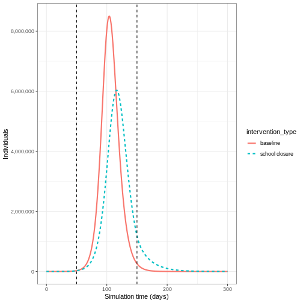
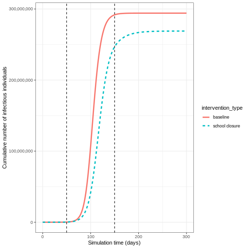
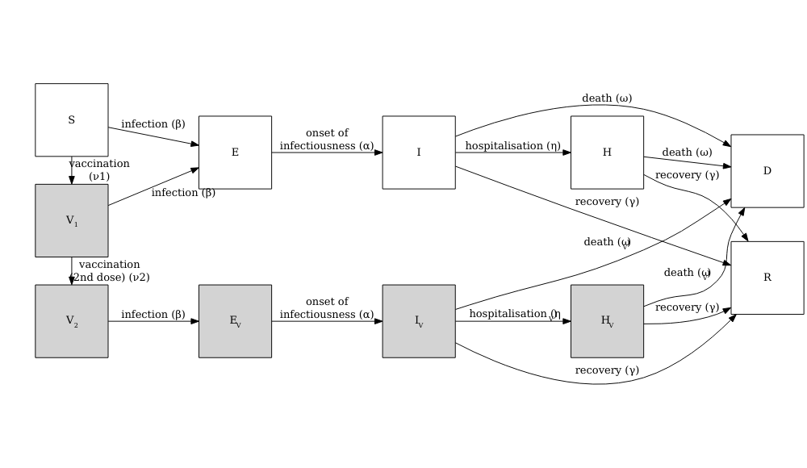
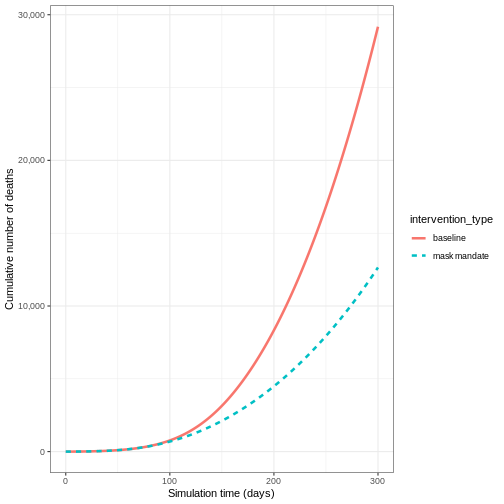

:::::::::::::::::::::::::::::::::::::: questions 

- How can I quantify the effect of an intervention?

 
::::::::::::::::::::::::::::::::::::::::::::::::

::::::::::::::::::::::::::::::::::::: objectives

- Compare intervention scenarios

::::::::::::::::::::::::::::::::::::::::::::::::

::::::::::::::::::::::::::::::::::::: prereq

+ Complete tutorials [Simulating transmission](../episodes/simulating-transmission.md) and [Modelling interventions](../episodes/modelling-interventions.md)

Learners should familiarise themselves with following concept dependencies before working through this tutorial: 

**Outbreak response** : [Intervention types](https://www.cdc.gov/nonpharmaceutical-interventions/).
:::::::::::::::::::::::::::::::::


## Introduction

In this tutorial, we will compare intervention scenarios against each other. To quantify the effect of an intervention, we need to compare our intervention scenario to a counterfactual (baseline) scenario. The *counterfactual* here is the scenario in which nothing changes, often referred to as the "do-nothing" scenario. The counterfactual scenario may feature:

- No interventions at all, or
- Existing interventions in place (if we are investigating the potential impact of an additional intervention)

We must also define our *outcome of interest* to make comparisons between intervention and counterfactual scenarios. The outcome of interest can be:

- Direct model outputs (e.g., number of infections, hospitalizations)
- Epidemiological metrics (e.g., epidemic peak time, final outbreak size)
- Health impact measures (e.g., Quality-Adjusted Life Years [QALYs] or Disability-Adjusted Life Years [DALYs])
- Economic measures (e.g., healthcare costs, productivity losses)

In this tutorial, we will learn how to use the R package `{epidemics}` to compare the effect of different interventions on simulated disease trajectories. We will use `{socialmixr}` for social contact data and `{tidyverse}` (including `{dplyr}`, `{ggplot2}`, and the pipe `%>%`) for data manipulation and visualization.


``` r
library(epidemics)
library(socialmixr)
library(tidyverse)
```

:::::::::::::::::::::::::::::::::::::::::::::::::::::::::::::::::::: instructor

In this tutorial we introduce the concept of the counter factual and how to compare scenarios (counter factual versus intervention) against each other. 

::::::::::::::::::::::::::::::::::::::::::::::::::::::::::::::::::::::::::::::::

## Visualising the effect of interventions 

To compare the baseline scenario against the intervention scenarios, we can make visualisations of our outcome of interest. The outcome of interest may simply be the model output, or it could be an aggregate measure of the model output.

If we wanted to investigate the change in epidemic peak with an intervention applied, we could plot the model trajectories through time:

``` r
output_baseline <- epidemics::model_default(
  population = uk_population,
  transmission_rate = transmission_rate,
  infectiousness_rate = infectiousness_rate,
  recovery_rate = recovery_rate,
  time_end = 300, increment = 1.0
)

output_school <- epidemics::model_default(
  # population
  population = uk_population,
  # rate
  transmission_rate = transmission_rate,
  infectiousness_rate = infectiousness_rate,
  recovery_rate = recovery_rate,
  # intervention
  intervention = list(contacts = close_schools),
  # time
  time_end = 300, increment = 1.0
)

# create intervention_type column for plotting
output_school$intervention_type <- "school closure"
output_baseline$intervention_type <- "baseline"
output <- rbind(output_school, output_baseline)

output %>%
  filter(compartment == "infectious") %>%
  ggplot() +
  aes(
    x = time,
    y = value,
    color = intervention_type,
    linetype = intervention_type
  ) +
  stat_summary(
    fun = "sum",
    geom = "line",
    linewidth = 1
  ) +
  scale_y_continuous(
    labels = scales::comma
  ) +
  geom_vline(
    xintercept = c(
      close_schools$time_begin,
      close_schools$time_end
    ),
    linetype = 2
  ) +
  theme_bw() +
  labs(
    x = "Simulation time (days)",
    y = "Individuals"
  )
```



If we wanted to quantify the impact of the intervention over the model output through time, we could consider the cumulative number of infectious people in the baseline scenario compared to the intervention scenario: 


``` r
output %>%
  filter(compartment == "infectious") %>%
  group_by(time, intervention_type) %>%
  summarise(value_total = sum(value)) %>%
  group_by(intervention_type) %>%
  mutate(cum_value = cumsum(value_total)) %>%
  ggplot() +
  geom_line(
    aes(
      x = time,
      y = cum_value,
      color = intervention_type,
      linetype = intervention_type
    ),
    linewidth = 1.2
  ) +
  scale_y_continuous(
    labels = scales::comma
  ) +
  geom_vline(
    xintercept = c(
      close_schools$time_begin,
      close_schools$time_end
    ),
    linetype = 2
  ) +
  theme_bw() +
  labs(
    x = "Simulation time (days)",
    y = "Cumulative number of infectious individuals"
  )
```

``` output
`summarise()` has grouped output by 'time'. You can override using the
`.groups` argument.
```




### Vacamole model

The Vacamole model is a deterministic model based on a system of Ordinary Differential Equations (ODEs) developed by [Ainslie et al. (2022)](https://doi.org/10.2807/1560-7917.ES.2022.27.44.2101090) to describe the effect of vaccination on COVID-19 dynamics. The model consists of 11 compartments, where individuals are classified as:

+ Susceptible ($S$)
+ Partially vaccinated ($V_1$)
+ Fully vaccinated ($V_2$)
+ Exposed ($E$) and exposed while vaccinated ($E_V$)
+ Infectious ($I$) and infectious while vaccinated ($I_V$)
+ Hospitalized ($H$) and hospitalized while vaccinated ($H_V$)
+ Dead ($D$)
+ Recovered ($R$)

The diagram below describes the flow of individuals through the different compartments.




::::::::::::::::::::::::::::::::::::: challenge

## Running a counterfactual scenario using the Vacamole model

1. Run the model with the default parameter values for the UK population assuming that:

+ One in every million individuals (0.0001%) is infectious (and not vaccinated) at the start of the simulation
+ The contact matrix for the United Kingdom has the following age bins:
  + 0-20 years
  + 20-40 years
  + 40+ years

For the following scenarios:

+ Baseline: Two-dose vaccination program
  - Dose 1 (vaccination rate 0.01) starts from day 30
  - Dose 2 (vaccination rate 0.01) starts from day 60
  - Both programs run for 300 days
+ Intervention: Mask mandate
  - Starts from day 60
  - Lasts for 100 days
  - Reduces transmission rate by 16.3% (based on empirical studies of mask effectiveness)

There is no vaccination scheme in place

2. Using the output, plot the cumulative number of deaths through time

::::::::::::::::: hint

### HINT : Running the model with default parameter values

We can run the Vacamole model with [default parameter values](https://epiverse-trace.github.io/epidemics/articles/model_vacamole.html#model-epidemic-using-vacamole) by just specifying the population object and number of time steps to run the model for:


``` r
output <- epidemics::model_vacamole(
  population = uk_population,
  time_end = 300
)
```

::::::::::::::::::::::


::::::::::::::::: solution

1.  Run the model


``` r
polymod <- socialmixr::polymod
contact_data <- socialmixr::contact_matrix(
  survey = polymod,
  countries = "United Kingdom",
  age.limits = c(0, 20, 40),
  symmetric = TRUE
)
```

``` output
Removing participants that have contacts without age information. To change this behaviour, set the 'missing.contact.age' option
```

``` r
# prepare contact matrix
contact_matrix <- t(contact_data$matrix)

# extract demography vector
demography_vector <- contact_data$demography$population
names(demography_vector) <- rownames(contact_matrix)

# prepare initial conditions
initial_i <- 1e-6

initial_conditions_vacamole <- c(
  S = 1 - initial_i,
  V1 = 0, V2 = 0,
  E = 0, EV = 0,
  I = initial_i, IV = 0,
  H = 0, HV = 0, D = 0, R = 0
)

initial_conditions_vacamole <- rbind(
  initial_conditions_vacamole,
  initial_conditions_vacamole,
  initial_conditions_vacamole
)
rownames(initial_conditions_vacamole) <- rownames(contact_matrix)

# prepare population object
uk_population_vacamole <- epidemics::population(
  name = "UK",
  contact_matrix = contact_matrix,
  demography_vector = demography_vector,
  initial_conditions = initial_conditions_vacamole
)

# prepare two vaccination objects
# dose 1 vaccination
dose_1 <- epidemics::vaccination(
  name = "two-dose vaccination", # name given to first dose
  nu = matrix(0.01, nrow = 3),
  time_begin = matrix(30, nrow = 3),
  time_end = matrix(300, nrow = 3)
)

# prepare the second dose with a 30 day interval in start date
dose_2 <- epidemics::vaccination(
  name = "two-dose vaccination", # name given to first dose
  nu = matrix(0.01, nrow = 3),
  time_begin = matrix(30 + 30, nrow = 3),
  time_end = matrix(300, nrow = 3)
)

# use `c()` to combine the two doses
double_vaccination <- c(dose_1, dose_2)

# run baseline model
output_baseline_vc <- epidemics::model_vacamole(
  population = uk_population_vacamole,
  vaccination = double_vaccination,
  time_end = 300
)

# create mask intervention
mask_mandate <- epidemics::intervention(
  name = "mask mandate",
  type = "rate",
  time_begin = 60,
  time_end = 60 + 100,
  reduction = 0.163
)

# run intervention model
output_intervention_vc <- epidemics::model_vacamole(
  population = uk_population_vacamole,
  vaccination = double_vaccination,
  intervention = list(
    transmission_rate = mask_mandate
  ),
  time_end = 300
)
```

2. Plot the cumulative number of deaths through time


``` r
# create intervention_type column for plotting
output_intervention_vc$intervention_type <- "mask mandate"
output_baseline_vc$intervention_type <- "baseline"
output_vacamole <- rbind(output_intervention_vc, output_baseline_vc)

output_vacamole %>%
  filter(compartment == "dead") %>%
  group_by(time, intervention_type) %>%
  summarise(value_total = sum(value)) %>%
  group_by(intervention_type) %>%
  mutate(cum_value = cumsum(value_total)) %>%
  ggplot() +
  geom_line(
    aes(
      x = time,
      y = cum_value,
      color = intervention_type,
      linetype = intervention_type
    ),
    linewidth = 1.2
  ) +
  scale_y_continuous(
    labels = scales::comma
  ) +
  theme_bw() +
  labs(
    x = "Simulation time (days)",
    y = "Cumulative number of deaths"
  )
```

``` output
`summarise()` has grouped output by 'time'. You can override using the
`.groups` argument.
```




:::::::::::::::::::::::::::


::::::::::::::::::::::::::::::::::::::::::::::::


## Calculating outcomes averted

While visualizations are useful for comparing intervention scenarios over time, we also need quantitative measures of intervention impact. One such measure is the number of infections averted, which helps us understand the difference between intervention scenarios.

The R package `{epidemics}` provides the `outcomes_averted()` function to calculate infections averted while accounting for parameter uncertainty. Let's extend our COVID-19 example from [Modelling interventions](../episodes/modelling-interventions.md) to account for uncertainty in the basic reproduction number ($R_0$).


``` r
# time periods
preinfectious_period <- 4.0
infectious_period <- 5.5

# specify the mean and standard deviation of R0
r_estimate_mean <- 2.7
r_estimate_sd <- 0.05

# generate 100 R samples
r_samples <- withr::with_seed(
  seed = 1,
  rnorm(
    n = 100, mean = r_estimate_mean, sd = r_estimate_sd
  )
)

beta <- r_samples / infectious_period

# rates
infectiousness_rate <- 1.0 / preinfectious_period
recovery_rate <- 1.0 / infectious_period
```

We use these parameter values alongside the population structure and contact matrix used in [Modelling interventions](../episodes/modelling-interventions.md) to run the model for the baseline scenario:


``` r
output_baseline <- epidemics::model_default(
  population = uk_population,
  transmission_rate = beta,
  infectiousness_rate = infectiousness_rate,
  recovery_rate = recovery_rate,
  time_end = 300, increment = 1.0
)
```


Then, we create a list of all the interventions we want to include in our comparison. We define our scenarios as follows:

+ scenario 1 : close schools
+ scenario 2 : mask mandate
+ scenario 3 : close schools and mask mandate.

In R we specify this as: 

``` r
intervention_scenarios <- list(
  scenario_1 = list(
    contacts = close_schools
  ),
  scenario_2 = list(
    transmission_rate = mask_mandate
  ),
  scenario_3 = list(
    contacts = close_schools,
    transmission_rate = mask_mandate
  )
)
```

We use this list as our input to `intervention` in `model_default`


``` r
output <- epidemics::model_default(
  uk_population,
  transmission_rate = beta,
  infectiousness_rate = infectiousness_rate,
  recovery_rate = recovery_rate,
  time_end = 300, increment = 1.0,
  intervention = intervention_scenarios
)
head(output)
```

``` output
   transmission_rate infectiousness_rate recovery_rate time_end param_set
               <num>               <num>         <num>    <num>     <int>
1:         0.4852141                0.25     0.1818182      300         1
2:         0.4852141                0.25     0.1818182      300         1
3:         0.4852141                0.25     0.1818182      300         1
4:         0.4925786                0.25     0.1818182      300         2
5:         0.4925786                0.25     0.1818182      300         2
6:         0.4925786                0.25     0.1818182      300         2
        population intervention vaccination time_dependence increment scenario
            <list>       <list>      <list>          <list>     <num>    <int>
1: <population[4]>    <list[1]>      [NULL]       <list[1]>         1        1
2: <population[4]>    <list[1]>      [NULL]       <list[1]>         1        2
3: <population[4]>    <list[2]>      [NULL]       <list[1]>         1        3
4: <population[4]>    <list[1]>      [NULL]       <list[1]>         1        1
5: <population[4]>    <list[1]>      [NULL]       <list[1]>         1        2
6: <population[4]>    <list[2]>      [NULL]       <list[1]>         1        3
                   data
                 <list>
1: <data.table[4515x4]>
2: <data.table[4515x4]>
3: <data.table[4515x4]>
4: <data.table[4515x4]>
5: <data.table[4515x4]>
6: <data.table[4515x4]>
```

Now that we have our model output for all of our scenarios, we want to compare the outputs of the interventions to our baseline. 

We can do this using `outcomes_averted()` in `{epidemics}`. This function calculates the final epidemic size for each scenario, and then calculates the number of infections averted in each scenario compared to the baseline. To use this function we specify the :
  
+ output of the baseline scenario
+ outputs of the intervention scenario(s).


``` r
intervention_effect <- epidemics::outcomes_averted(
  baseline = output_baseline, scenarios = output
)
intervention_effect
```

``` output
   scenario demography_group averted_median averted_lower averted_upper
      <int>           <char>          <num>         <num>         <num>
1:        1              65+       405810.5      383340.3      414044.8
2:        1           [0,15)      2890964.4     2577490.7     3082420.9
3:        1          [15,65)      1288482.1     1257862.4     1290841.4
4:        2              65+       900819.9      882242.1      912790.7
5:        2           [0,15)       517742.8      478431.1      558631.8
6:        2          [15,65)      2413423.7     2259624.9     2566010.9
7:        3              65+      1004123.7      864726.7     1100018.0
8:        3           [0,15)      1974788.9     1494800.2     2415088.5
9:        3          [15,65)      2908140.6     2546313.2     3129329.3
```

The output gives us the infections averted in each scenario compared to the baseline. To obtain the infections averted overall we specify `by_group = FALSE`:


``` r
intervention_effect <- epidemics::outcomes_averted(
  baseline = output_baseline, scenarios = output,
  by_group = FALSE
)
intervention_effect
```

``` output
   scenario averted_median averted_lower averted_upper
      <int>          <num>         <num>         <num>
1:        1        4587505       4220698       4770734
2:        2        3831986       3620298       4037433
3:        3        5887053       4905840       6644436
```


::::::::::::::::::::::::::: testimonial

### Package vignettes

We recommend to read the vignette on [Modelling responses to a stochastic Ebola virus epidemic](https://epiverse-trace.github.io/epidemics/articles/model_ebola.html) to use a discrete time, stochastic compartmental model of Ebola used during the 2014 West African EVD outbreak.

:::::::::::::::::::::::::::


::::::::::::::::::::::::::::::::::::: challenge 

## Challenge : Ebola outbreak analysis

You have been tasked to investigate the potential impact of an intervention on an Ebola outbreak in Guinea (e.g. a reduction in risky contacts with cases). Using `model_ebola()` and the the information detailed below, find the number of infections averted when :

+ an intervention is applied to reduce the transmission rate by 50% from day 60 and,
+ an intervention is applied to reduce transmission by 10% from day 30.

For both interventions, we assume there is some uncertainty about the baseline transmission rate. We capture this uncertainty by drawing from a normal distribution with mean = 1.1 / 12 (i.e. $R_0=1.1$ and infectious period = 12 days) and  standard deviation = 0.01.

*Note: Depending on the number of replicates used, this simulation may take several minutes to run.*

+ Population size : 14 million
+ Initial number of exposed individuals : 10
+ Initial number of infectious individuals : 5
+ Time of simulation : 120 days
+ Parameter values : 
  + $R_0$ (`r0`) = 1.1,
  + $p^I$ (`infectious_period`) = 12,
  + $p^E$ (`preinfectious_period`) = 5,
  + $k^E=k^I = 2$, 
  + $1-p_{hosp}$ (`prop_community`) = 0.9,
  + $p_{ETU}$ (`etu_risk`) = 0.7,
  + $p_{funeral}$ (`funeral_risk`) = 0.5

:::::::::::::::::::::::: solution 


``` r
population_size <- 14e6

E0 <- 10
I0 <- 5
# prepare initial conditions as proportions
initial_conditions <- c(
  S = population_size - (E0 + I0), E = E0, I = I0, H = 0, F = 0, R = 0
) / population_size

# set up population object
guinea_population <- population(
  name = "Guinea",
  contact_matrix = matrix(1), # note dummy value
  demography_vector = population_size, # 14 million, no age groups
  initial_conditions = matrix(
    initial_conditions,
    nrow = 1
  )
)

# generate 100 beta samples
beta <- withr::with_seed(
  seed = 1,
  rnorm(
    n = 100, mean = 1.1 / 12, sd = 0.01
  )
)

# run the baseline
output_baseline <- epidemics::model_ebola(
  population = guinea_population,
  transmission_rate = beta,
  infectiousness_rate = 2.0 / 5,
  removal_rate = 2.0 / 12,
  prop_community = 0.9,
  etu_risk = 0.7,
  funeral_risk = 0.5,
  time_end = 100,
  replicates = 100 # replicates argument
)

# create intervention objects
reduce_transmission_1 <- epidemics::intervention(
  type = "rate",
  time_begin = 60, time_end = 100, reduction = 0.5
)

reduce_transmission_2 <- epidemics::intervention(
  type = "rate",
  time_begin = 30, time_end = 100, reduction = 0.1
)

# create intervention list
intervention_scenarios <- list(
  scenario_1 = list(
    transmission_rate = reduce_transmission_1
  ),
  scenario_2 = list(
    transmission_rate = reduce_transmission_2
  )
)

# run model
output_intervention <- epidemics::model_ebola(
  population = guinea_population,
  transmission_rate = beta,
  infectiousness_rate = 2.0 / 5,
  removal_rate = 2.0 / 12,
  prop_community = 0.9,
  etu_risk = 0.7,
  funeral_risk = 0.5,
  time_end = 100,
  replicates = 100, # replicates argument,
  intervention = intervention_scenarios
)
```

``` warning
Warning: Running 2 scenarios and 100 parameter sets with 100 replicates each, for a
total of 20000 model runs.
```

``` r
# calculate outcomes averted
intervention_effect <- epidemics::outcomes_averted(
  baseline = output_baseline, scenarios = output_intervention,
  by_group = FALSE
)
intervention_effect
```

``` output
   scenario averted_median averted_lower averted_upper
      <int>          <num>         <num>         <num>
1:        1             31             1           112
2:        2             20           -22           105
```


**Note: The number of infections averted can be negative. This is due to the stochastic variation in the disease trajectories for a given transmission rate can result in a different size outbreak.**


:::::::::::::::::::::::::::::::::
::::::::::::::::::::::::::::::::::::::::::::::::


::::::::::::::::::::::::::::::::::::: keypoints 

- A counterfactual (baseline) scenario must be clearly defined for meaningful comparisons
- Scenarios can be compared using both visualizations and quantitative measures
- The outcomes_averted() function helps quantify intervention effects
- Parameter uncertainty should be considered in intervention analysis

::::::::::::::::::::::::::::::::::::::::::::::::

