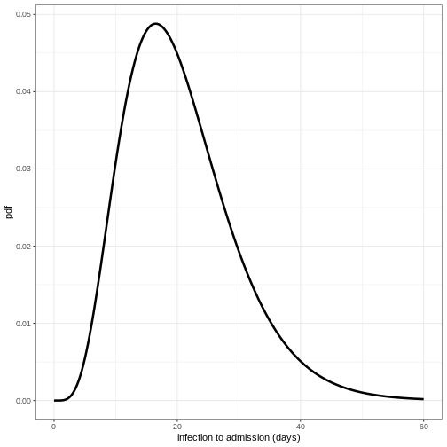
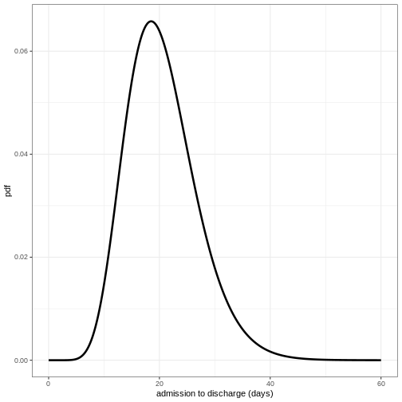
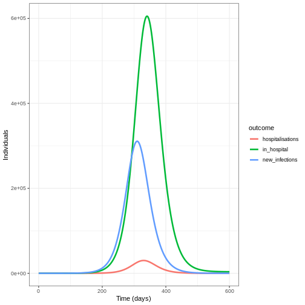

:::::::::::::::::::::::::::::::::::::: questions 

- How can we model disease burden and healthcare demand?

::::::::::::::::::::::::::::::::::::::::::::::::

::::::::::::::::::::::::::::::::::::: objectives

- Understand when mathematical models of transmission can be separated from models of burden
- Generate estimates of disease burden and healthcare demand using a burden model

::::::::::::::::::::::::::::::::::::::::::::::::

::::::::::::::::::::::::::::::::::::: prereq

+ Complete tutorial on [Simulating transmission](../episodes/simulating-transmission.md)

:::::::::::::::::::::::::::::::::


## Introduction

In previous tutorials we have used mathematical models to generate trajectories of infections, but we may also be interested in measures of disease burden. These measures could include:

- Health outcomes in the population (e.g., mild vs. severe infections)
- Healthcare system impacts (e.g., hospitalizations, ICU admissions)
- Economic impacts (e.g., productivity loss, healthcare costs)

In mathematical models, we can track disease burden in different ways:

1. **Integrated approach**: Include burden compartments directly in the transmission model (e.g., hospital compartments in ODE models)
2. **Separated approach**: First simulate transmission, then use the results to estimate burden

The choice between these approaches depends on whether burden affects transmission. For example:

- For Ebola, hospitalizations are important for transmission due to high-risk healthcare settings
- For many respiratory infections, severe illness typically occurs after the infectious period, so burden can be modeled separately

In this tutorial, we'll focus on the separated approach, where we first run an epidemic model to simulate infections, then use these values to estimate disease burden as a follow-on analysis. We'll use `{epidemics}` to simulate disease trajectories, `{socialmixr}` for social contact data, and `{tidyverse}` for data manipulation and plotting. 


``` r
library(epiparameter)
library(epidemics)
library(socialmixr)
library(tidyverse)
```


:::::::::::::::::::::::::::::::::::::::::::::::::::::::::::::::::::: instructor

Inline instructor notes can help inform instructors of timing challenges
associated with the lessons. They appear in the "Instructor View".


::::::::::::::::::::::::::::::::::::::::::::::::::::::::::::::::::::::::::::::::


## A burden model

We will extend the influenza example from the [Simulating transmission](../episodes/simulating-transmission.md) tutorial by using the `output` object to calculate hospitalizations over time. Our approach has two main components:

1. **Transmission model**: An SEIR model that generates new infections over time
2. **Burden model**: Converts new infections to hospitalizations by accounting for delays between infection and hospitalization

To convert infections to hospitalizations, we need to consider:

- The probability that an infection leads to hospitalization (infection-hospitalization ratio, IHR)
- The time delay from infection to hospital admission
- The time spent in hospital before discharge

We'll use `{epiparameter}` to define these delay distributions. The Gamma distribution is commonly used for these delays because:

- It's flexible and can model various shapes
- It's bounded at zero (negative delays don't make sense)
- It's supported by empirical data for many infectious diseases

:::::::::::::::: instructor


``` r
# load contact and population data from socialmixr::polymod
polymod <- socialmixr::polymod
contact_data <- socialmixr::contact_matrix(
  polymod,
  countries = "United Kingdom",
  age.limits = c(0, 20, 40),
  symmetric = TRUE
)

# prepare contact matrix
contact_matrix <- t(contact_data$matrix)

# prepare the demography vector
demography_vector <- contact_data$demography$population
names(demography_vector) <- rownames(contact_matrix)

# initial conditions: one in every 1 million is infected
initial_i <- 1e-6
initial_conditions_inf <- c(
  S = 1 - initial_i, E = 0, I = initial_i, R = 0, V = 0
)

initial_conditions_free <- c(
  S = 1, E = 0, I = 0, R = 0, V = 0
)

# build for all age groups
initial_conditions <- rbind(
  initial_conditions_inf,
  initial_conditions_free,
  initial_conditions_free
)
rownames(initial_conditions) <- rownames(contact_matrix)

# prepare the population to model as affected by the epidemic
uk_population <- epidemics::population(
  name = "UK",
  contact_matrix = contact_matrix,
  demography_vector = demography_vector,
  initial_conditions = initial_conditions
)

# time periods
preinfectious_period <- 3.0
infectious_period <- 7.0
basic_reproduction <- 1.46

# rates
infectiousness_rate <- 1.0 / preinfectious_period
recovery_rate <- 1.0 / infectious_period
transmission_rate <- basic_reproduction / infectious_period

# run an epidemic model using `epidemic()`
output <- epidemics::model_default(
  population = uk_population,
  transmission_rate = transmission_rate,
  infectiousness_rate = infectiousness_rate,
  recovery_rate = recovery_rate,
  time_end = 600, increment = 1.0
)
```

::::::::::::::::


``` r
new_cases <- new_infections(output, by_group = FALSE)
head(new_cases)
```

``` output
Key: <time>
    time new_infections
   <num>          <num>
1:     0       0.000000
2:     1       3.468452
3:     2       3.206039
4:     3       3.110541
5:     4       3.115967
6:     5       3.183338
```

To convert the new infections to hospitalisations we need to parameter distributions to describe the following processes :

+ the time from infection to admission to hospital,

+ the time from admission to discharge from hospital. 

We will use the function `epiparameter()` from `{epiparameter}` package to define and store parameter distributions for these processes.


``` r
# define delay parameters
infection_to_admission <- epiparameter(
  disease = "COVID-19",
  epi_name = "infection to admission",
  prob_distribution = create_prob_distribution(
    prob_distribution = "gamma",
    prob_distribution_params = c(shape = 5, scale = 4),
    discretise = TRUE
  )
)

# The shape and scale parameters were chosen based on data from COVID-19 studies
# showing a median time from infection to hospitalization of around 10 days
# with right-skewed distribution reflecting variability in disease progression
```

To visualise this distribution we can create a density plot :


``` r
x_range <- seq(0, 60, by = 0.1)
density_df <- data.frame(days = x_range,
                         density_admission = density(infection_to_admission,
                                                     x_range))

ggplot(data = density_df, aes(x = days, y = density_admission))  +
  geom_line(linewidth = 1.2) +
  theme_bw() +
  labs(
    x = "infection to admission (days)",
    y = "pdf"
  )
```




::::::::::::::::::::::::::::::::::::: challenge 

## Define distribution for admission to discharge

Using the function `epiparameter()` define the distribution for admission to discharge as a Gamma distribution with shape = 10 and scale = 2 and plot the density of this distribution. 

:::::::::::::::::::::::: solution 
 

``` r
admission_to_discharge <- epiparameter(
  disease = "COVID-19",
  epi_name = "admission to discharge",
  prob_distribution = create_prob_distribution(
    prob_distribution = "gamma",
    prob_distribution_params = c(shape = 10, scale = 2),
    discretise = TRUE
  )
)

x_range <- seq(0, 60, by = 0.1)
density_df <- data.frame(days = x_range,
                         density_discharge = density(admission_to_discharge,
                                                     x_range))


ggplot(data = density_df, aes(x = days, y = density_discharge)) +
  geom_line(linewidth = 1.2) +
  theme_bw() +
  labs(
    x = "admission to discharge (days)",
    y = "pdf"
  )
```



:::::::::::::::::::::::::::::::::
::::::::::::::::::::::::::::::::::::::::::::::::

To convert the new infections to number in hospital over time we will do the following:

1. Calculate the expected numbers of new infections that will be hospitalised using the infection hospitalisation ratio (IHR)
2. Calculate the estimated number of new hospitalisations at each point in time using the infection to admission distribution
3. Calculate the estimated number of discharge at each point in time using the admission to discharge distribution
4. Calculate the number in hospital at each point in time as the difference between the cumulative sum of hospital admissions and the cumulative sum of discharges so far.


#### 1. Calculate the expected numbers of new hospitalisations using the infection hospitalisation ratio (IHR)

``` r
ihr <- 0.1 # infection-hospitalisation ratio
# This value is based on estimates from early COVID-19 data
# and represents the proportion of infections that require hospitalization

# calculate expected numbers with convolution:
hosp <- new_cases$new_infections * ihr
```

#### 2. Calculate the estimated number of new hospitalisations using the infection to admission distribution

To estimate the number of new hospitalisations we use a method called convolution. 

::::::::::::::::::::::::::::::::::::: callout
### What is convolution?

If we want to know how people are admitted to hospital on day $t$, then we need to add up the number of people admitted on day $t$ but infected on day $t-1$, day $t-2$, day $t-3$ etc. We therefore need to sum over the distribution of delays from infection to admission. If $f_j$ is the probability an infected individual who will be hospitalised will be admitted to hospital $j$ days later, and $I_{t-j}$ is the number of individuals infected on day $t-j$, then the total admissions on day $t$ is equal to $\sum_j I_{t-j} f_j$.  This type of rolling calculation is known as a convolution (see this [Wolfram article](https://mathworld.wolfram.com/Convolution.html) for some mathematical detail). There are different methods to calculate convolutions, but we will use the built in R function `convolve()`to perform the summation efficiently from the number of infections and the delay distribution.

::::::::::::::::::::::::::::::::::::::::::::::::

The function `convolve()` requires inputs of two vectors which will be convolved and `type`. Here we will specify `type = "open"`, this fills the vectors with 0s to ensure they are the same length. 

The inputs to be convolved are the expected number of infections that will end up hospitalised (`hosp`) and the density values of the distribution of infection to admission times. We will calculate the density for the minimum possible value (0 days) up to the tail of the distribution (here defined as the 99.9th quantile, i.e. it is very unlikely any cases will be hospitalised after a delay this long).

Convolution requires one of the inputs to be reversed, in our case we will reverse the density distribution of infection to admission times. This is because if people infected earlier in time get admitted today, it means they've had a longer delay from infection to admission than someone infected more recently. In effect the infection to admission delay tells us how far we have to 'rewind' time to find previously new infections that are now showing up as hospital admissions.


``` r
# define tail of the delay distribution
tail_value_admission <- quantile(infection_to_admission, 0.999)

hospitalisations <- convolve(hosp,
                             rev(density(infection_to_admission,
                                         0:tail_value_admission)),
                             type = "open")[seq_along(hosp)]
```


#### 3. Calculate the estimated number of discharges

Using the same approach as above, we convolve the hospitalisations with the distribution of admission to discharge times to obtain the estimated number of new discharges.


``` r
tail_value_discharge <- quantile(admission_to_discharge, 0.999)
discharges <- convolve(hospitalisations, rev(density(admission_to_discharge,
                                                     0:tail_value_discharge)),
                       type = "open")[seq_along(hospitalisations)]
```

#### 4. Calculate the number in hospital as the difference between the cumulative sum of hospitalisations and the cumulative sum of discharges

We can use the R function `cumsum()` to calculate the cumulative number of hospitalisations and discharges. The difference between these two quantities gives us the current number of people in hospital at each time point.


``` r
# calculate the current number in hospital
in_hospital <- cumsum(hospitalisations) - cumsum(discharges)
```

We create a data frame to plot our outcomes using `pivot_longer()`:

``` r
# create data frame
hosp_df <- cbind(new_cases, in_hospital = in_hospital,
                 hospitalisations = hospitalisations)
# pivot longer for plotting
hosp_df_long <- pivot_longer(hosp_df, cols = new_infections:hospitalisations,
                             names_to = "outcome", values_to = "value")


ggplot(data = hosp_df_long) +
  geom_line(
    aes(
      x = time,
      y = value,
      colour = outcome
    ),
    linewidth = 1.2
  ) +
  theme_bw() +
  labs(
    x = "Time (days)",
    y = "Individuals"
  )
```



## Summary

In this tutorial, we learned how to estimate hospitalizations based on daily new infections from a transmission model. This approach can be extended to other measures of disease burden, such as:

- ICU admissions
- Deaths
- Disability-Adjusted Life-Years (DALYs)
- Healthcare costs

These burden estimates are valuable for:

- Healthcare system planning
- Health economic analyses
- Policy decision-making

As a follow-up, you might be interested in [this how-to guide](https://epiverse-trace.github.io/howto/analyses/reconstruct_transmission/estimate_infections.html), which shows how to estimate original infection events from reported hospitalizations or deaths over time.

::::::::::::::::::::::::::::::::::::: keypoints 

- Transmission models should include disease burden when it affects onward transmission
- Outputs of transmission models can be used as inputs to models of burden
- The Gamma distribution is commonly used to model delays in disease progression
- Convolution is a powerful tool for estimating disease burden from transmission model outputs

::::::::::::::::::::::::::::::::::::::::::::::::

