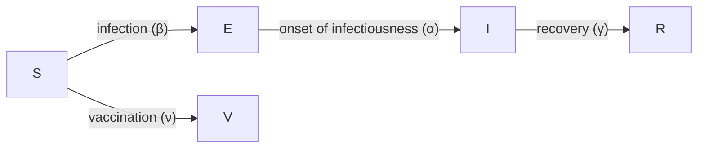

```{r setup, echo= FALSE, message = FALSE, warning = FALSE}
library(ggplot2)
library(epidemics)
```

:::::::::::::::::::::::::::::::::::::: questions 

- How do I investigate the effect of interventions on disease trajectories? 

::::::::::::::::::::::::::::::::::::::::::::::::

::::::::::::::::::::::::::::::::::::: objectives

- Add pharmaceutical and non-pharmaceutical interventions to `{epidemics}` model

::::::::::::::::::::::::::::::::::::::::::::::::

::::::::::::::::::::::::::::::::::::: prereq

+ Complete tutorial on [Simulating transmission](../episodes/simulating-transmission.md).

Learners should also familiarise themselves with the following concept dependencies before working through this tutorial: 

**Outbreak response**: [Intervention types](https://www.cdc.gov/nonpharmaceutical-interventions/).

**R packages installed**: `{epidemics}`, `{contactsurveys}`, `{socialmixr}`, `{wpp2024}`, `{scales}`, `{tidyverse}`.

:::::::::::::::::::::::::::::::::

:::::::::: spoiler

Install packages if they are not already installed

```r
if (!base::require("pak")) install.packages("pak")
pak::pak(c("epiverse-trace/epidemics", "PPgp/wpp2024", "contactsurveys", "socialmixr", "scales", "tidyverse"))
```

If you have any error message,
go to the [main setup page](../learners/setup.md#software-setup).

::::::::::

## Introduction

Mathematical models can be used to generate trajectories of disease spread under the implementation of interventions at different stages of an outbreak. These trajectories can be used to make decisions on what interventions could be implemented to slow down the spread of diseases. 

Interventions are usually incorporated into mathematical models via manipulating values of relevant parameters, e.g., reduce transmission, or via introducing a new disease state, e.g., vaccinated class where we assume that individuals who belong to this class are no longer susceptible to infection.

In this tutorial, we will learn how to use `{epidemics}` to model interventions and access to social contact data with `{socialmixr}`. We'll use `{dplyr}`, `{ggplot2}` and the pipe `%>%` to connect some of their functions, so let's also call `{tidyverse}`:

```{r,message=FALSE,warning=FALSE}
library(epidemics)
library(contactsurveys)
library(socialmixr)
library(wpp2024)
library(tidyverse)
```


:::::::::::::::::::::::::::::::::::::::::::::::::::::::::::::::::::: instructor

In this tutorial different types of intervention and how they can be modelled are introduced. Learners should be able to understand the underlying mechanism of these interventions (e.g. reduce contact rate) as well as how to implement the code to include such interventions.

::::::::::::::::::::::::::::::::::::::::::::::::::::::::::::::::::::::::::::::::

:::::::::::::::::::::: instructor

Share with learners the code for the baseline model.

It has **different** disease parameters than previous episode.

Then start with the livecoding directly with interventions.

::::::::::::::::::::::

## Baseline model

We will investigate the effect of interventions on a COVID-19 outbreak using an SEIR model (`model_default()` in the R package `{epidemics}`). To be able to see the effect of our intervention, we will run a baseline variant of the model, i.e,  without intervention.

The SEIR model divides the population into four compartments: Susceptible (S), Exposed (E), Infectious (I), and Recovered (R). We will set the following parameters for our model: $R_0 = 2.7$ (basic reproduction number), latent period or pre-infectious period $= 4$ days, and the infectious period $= 5.5$ days (parameters adapted from [Davies et al. (2020)](https://doi.org/10.1016/S2468-2667(20)30133-X)). We adopt a contact matrix with age bins 0-15, 15-65, 65 years and older using `{socialmixr}`, and assume that one in every 1 million individuals in each age group is infectious at the start of the epidemic.

```{r model_setup, echo = TRUE, message = FALSE, warning = FALSE}
# download and load survey data
survey_files <- contactsurveys::download_survey(
  survey = "https://doi.org/10.5281/zenodo.3874557",
  verbose = FALSE
)
survey_load <- socialmixr::load_survey(files = survey_files)

data(popAge1dt, package = "wpp2024")

uk_pop <- popAge1dt %>%
  dplyr::filter(name == "United Kingdom", year == 2020) %>%
  dplyr::select(lower.age.limit = age, population = pop) %>%
  dplyr::mutate(population = population * 1000)

# generate contact matrix
contacts_byage <- socialmixr::contact_matrix(
  survey = survey_load,
  countries = "United Kingdom",
  age_limits = c(0, 15, 65),
  symmetric = TRUE,
  survey_pop = uk_pop
)

# prepare contact matrix
contacts_byage_matrix <- contacts_byage$matrix

# prepare the demography vector
demography_vector <- contacts_byage$demography$population
names(demography_vector) <- rownames(contacts_byage_matrix)

# initial conditions: one in every 1 million is infected
initial_i <- 1e-6
initial_conditions <- c(
  S = 1 - initial_i,
  E = 0,
  I = initial_i,
  R = 0,
  V = 0
)

# build for all age groups
initial_conditions <- base::rbind(
  initial_conditions,
  initial_conditions,
  initial_conditions
)
rownames(initial_conditions) <- rownames(contacts_byage_matrix)

# prepare the population to model as affected by the epidemic
uk_population <- epidemics::population(
  name = "UK",
  contact_matrix = contacts_byage_matrix,
  demography_vector = demography_vector,
  initial_conditions = initial_conditions
)
```

We run the model with an infectiousness rate $= 1/4$, a recovery rate $= 1/5.5$, and a transmission rate $= 2.7/5.5$ (remember that [transmission rate = $R_0$* recovery rate](../episodes/simulating-transmission.md#the-basic-reproduction-number-r_0)) as follows:

```{r, echo = TRUE, message = FALSE}
# time periods
preinfectious_period <- 4.0
infectious_period <- 5.5
basic_reproduction <- 2.7

# rates
infectiousness_rate <- 1.0 / preinfectious_period
recovery_rate <- 1.0 / infectious_period
transmission_rate <- basic_reproduction * recovery_rate

# run baseline simulation with no intervention
output_baseline <- epidemics::model_default(
  population = uk_population,
  transmission_rate = transmission_rate,
  infectiousness_rate = infectiousness_rate,
  recovery_rate = recovery_rate,
  time_end = 300, increment = 1.0
)
```

:::::::::::::::::::::: instructor

Make a pause.

Use slides to introduce the topics of:

- Non pharmaceutical interventions.

Then continue with the livecoding.

::::::::::::::::::::::

## Non-pharmaceutical interventions

[Non-pharmaceutical interventions](../learners/reference.md#NPIs) (NPIs) are measures put in place to reduce transmission that do not include the administration of drugs or vaccinations. NPIs aim at reducing contacts between infectious and susceptible individuals by closure of schools and workplaces, and other measures to prevent the spread of the disease,  for example, washing hands and wearing masks.

### Effect of school closures on COVID-19 spread

The first NPI we will consider is the effect of school closures on reducing the number of individuals infected with COVID-19 over time. We assume that a school closure will reduce the frequency of contacts within and between different age groups. Based on empirical studies, we assume that school closures will reduce the contacts between school-aged children (aged 0-15) by 50%, and will cause a small reduction (1%) in the contacts between adults (aged 15 and over). 

To include an intervention in our model we must create an `intervention` object. The inputs are the name of the intervention (`name`), the type of intervention (`contacts` or `rate`), the start time (`time_begin`), the end time (`time_end`) and the reduction (`reduction`). The values of the reduction matrix are specified in the same order as the age groups in the contact matrix. 

```{r}
rownames(contacts_byage_matrix)
```

Therefore, we specify `reduction = matrix(c(0.5, 0.01, 0.01))`. We assume that the school closures start on day 50 and continue to be in place for a further 100 days. Therefore our intervention object is: 

```{r intervention}
close_schools <- epidemics::intervention(
  name = "School closure",
  type = "contacts",
  time_begin = 50,
  time_end = 50 + 100,
  reduction = matrix(c(0.5, 0.01, 0.01))
)
```

::::::::::::::::::::::::::::::::::::: callout
### Effect of interventions on contacts

In `{epidemics}`, the contact matrix is scaled down by proportions for the period in which the intervention is in place. To understand how the reduction is calculated within the model functions, consider a contact matrix for two age groups with equal number of contacts:

```{r echo = FALSE}
reduction <- matrix(c(0.5, 0.1))
contact_matrix_example <- matrix(c(1, 1, 1, 1), nrow = 2)
contact_matrix_example
```

If the reduction is 50% in group 1 and 10% in group 2, the contact matrix during the intervention will be:

```{r echo = FALSE}
contact_matrix_example[1, ] <- contact_matrix_example[1, ] * (1 - reduction[1])
contact_matrix_example[, 1] <- contact_matrix_example[, 1] * (1 - reduction[1])
contact_matrix_example[2, ] <- contact_matrix_example[2, ] * (1 - reduction[2])
contact_matrix_example[, 2] <- contact_matrix_example[, 2] * (1 - reduction[2])
contact_matrix_example
```

The contacts within group 1 are reduced by 50% twice to accommodate for a 50% reduction in outgoing and incoming contacts ($1\times 0.5 \times 0.5 = 0.25$). Similarly, the contacts within group 2 are reduced by 10% twice. The contacts between group 1 and group 2 are reduced by 50% and then by 10% ($1 \times 0.5 \times 0.9= 0.45$). 

::::::::::::::::::::::::::::::::::::::::::::::::

We run the model with ` intervention = list(contacts = close_schools)` as follows:

```{r school}
output_school <- epidemics::model_default(
  # population
  population = uk_population,
  # rate
  transmission_rate = transmission_rate,
  infectiousness_rate = infectiousness_rate,
  recovery_rate = recovery_rate,
  # intervention
  intervention = list(contacts = close_schools),
  # time
  time_end = 300, increment = 1.0
)
```


To observe the effect of our intervention, we will combine the baseline and intervention outputs into a single data frame and then plot the results. Here we plot the total number of infectious individuals in all age groups using `ggplot2::stat_summary()` function:

```{r baseline, echo = TRUE, fig.width = 10}
# create intervention_type column for plotting
output_school$intervention_type <- "school closure"
output_baseline$intervention_type <- "baseline"
output <- base::rbind(output_school, output_baseline)

output %>%
  filter(compartment == "infectious") %>%
  ggplot() +
  aes(
    x = time,
    y = value,
    color = intervention_type,
    linetype = intervention_type
  ) +
  stat_summary(
    fun = "sum",
    geom = "line",
    linewidth = 1
  ) +
  scale_y_continuous(
    labels = scales::comma
  ) +
  geom_vline(
    xintercept = c(
      close_schools$time_begin,
      close_schools$time_end
    ),
    linetype = 2
  ) +
  theme_bw() +
  labs(
    x = "Simulation time (days)",
    y = "Individuals"
  )
```

We can see that with the intervention in place, the infection still spreads through the population and hence accumulation of immunity contributes to the eventual peak-and-decline. However, the peak number of infectious individuals is smaller (green dashed line) than the baseline with no intervention in place (red solid line), showing a reduction in the absolute number of cases.


### Effect of mask wearing on COVID-19 spread

We can also model the effect of other NPIs by reducing the value of the relevant parameters. For example, investigating the effect of mask wearing on the number of individuals infected with COVID-19 over time. 

We expect that mask wearing will reduce an individual's infectiousness, based on multiple studies showing the effectiveness of masks in reducing transmission. As we are using a population-based model, we cannot make changes to individual behavior and so assume that the transmission rate $\beta$ is reduced by a proportion due to mask wearing in the population. We specify this proportion, $\theta$ as product of the proportion wearing masks multiplied by the proportion reduction in transmission rate (adapted from [Li et al. 2020](https://doi.org/10.1371/journal.pone.0237691)).

We create an intervention object with `type = "rate"` and `reduction = 0.161`. Using parameters adapted from [Li et al. 2020](https://doi.org/10.1371/journal.pone.0237691) we have proportion wearing masks = coverage $\times$ availability = $0.54 \times 0.525 = 0.2835$ and proportion reduction in transmission rate = $0.575$. Therefore, $\theta = 0.2835 \times 0.575 = 0.163$. We assume that the mask wearing mandate starts at day 40 and continue to be in place for 200 days.

```{r masks}
mask_mandate <- epidemics::intervention(
  name = "mask mandate",
  type = "rate",
  time_begin = 40,
  time_end = 40 + 200,
  reduction = 0.163
)
```

To implement this intervention on the transmission rate $\beta$, we specify `intervention = list(transmission_rate = mask_mandate)`.

```{r output_masks}
output_masks <- epidemics::model_default(
  # population
  population = uk_population,
  # rate
  transmission_rate = transmission_rate,
  infectiousness_rate = infectiousness_rate,
  recovery_rate = recovery_rate,
  # intervention
  intervention = list(transmission_rate = mask_mandate),
  # time
  time_end = 300, increment = 1.0
)
```


```{r plot_masks, echo = TRUE, message = FALSE, fig.width = 10}
# create intervention_type column for plotting
output_masks$intervention_type <- "mask mandate"
output_baseline$intervention_type <- "baseline"
output <- base::rbind(output_masks, output_baseline)

output %>%
  filter(compartment == "infectious") %>%
  ggplot() +
  aes(
    x = time,
    y = value,
    color = intervention_type,
    linetype = intervention_type
  ) +
  stat_summary(
    fun = "sum",
    geom = "line",
    linewidth = 1
  ) +
  scale_y_continuous(
    labels = scales::comma
  ) +
  geom_vline(
    xintercept = c(
      mask_mandate$time_begin,
      mask_mandate$time_end
    ),
    linetype = 2
  ) +
  theme_bw() +
  labs(
    x = "Simulation time (days)",
    y = "Individuals"
  )
```

::::::::::::::::::::::::::::::::::::: callout
### Intervention types

There are two intervention types for `model_default()`. Rate interventions on model parameters (`transmission_rate` $\beta$, `infectiousness_rate` $\sigma$ and `recovery_rate` $\gamma$) and contact matrix reductions (`contacts`).

To implement both contact and rate interventions in the same simulation they must be passed as a list, e.g., `intervention = list(transmission_rate = mask_mandate, contacts = close_schools)`. But if there are multiple interventions that target contact rates, these must be passed as one `contacts` input. See the [vignette on modelling overlapping interventions](https://epiverse-trace.github.io/epidemics/articles/modelling_multiple_interventions.html) for more detail. 

::::::::::::::::::::::::::::::::::::::::::::::::

:::::::::::::::::::::: instructor

Make a pause.

Use slides to introduce the topics of:

- Pharmaceutical interventions.

Then continue with the livecoding.

::::::::::::::::::::::

## Pharmaceutical interventions

Pharmaceutical interventions (PIs) are measures such as vaccination and mass treatment programs. In the previous section, we integrated the interventions into the model by reducing parameter values during a specific time period in which these intervention are set to take place. In the case of vaccination, we assume that after the intervention, some or all individuals are no longer susceptible and should be classified into a different disease state. Therefore, we specify the rate at which individuals are vaccinated and track the number of vaccinated individuals over time. 

The diagram below shows the SEIRV model implemented using `model_default()` where susceptible individuals are vaccinated and then move to the $V$ class.




The equations describing this model are as follows: 

$$
\begin{aligned}
\frac{dS_i}{dt} & = - \beta S_i \sum_j C_{i,j} I_j/N_j -\nu_{t} S_i \\
\frac{dE_i}{dt} &= \beta S_i\sum_j C_{i,j} I_j/N_j - \alpha E_i \\
\frac{dI_i}{dt} &= \alpha E_i - \gamma I_i \\
\frac{dR_i}{dt} &=\gamma I_i \\
\frac{dV_i}{dt} & =\nu_{i,t} S_i\\
\end{aligned}
$$

Individuals in age group ($i$) at specific time dependent ($t$)  are vaccinated at rate ($\nu_{i,t}$). The other SEIR components of these equations are described in the tutorial [simulating transmission](../episodes/simulating-transmission.md#simulating-disease-spread). 

To explore the effect of vaccination we need to create a vaccination object to pass as an input into `model_default()` that includes  age-group-specific vaccination rate `nu` and age-group-specific start and end times of the vaccination program (`time_begin` and `time_end`). 

Here we will assume all age groups are vaccinated at the same rate 0.01 and that the vaccination program starts on day 40 and continue to be in place for 150 days.

```{r vaccinate}
# prepare a vaccination object
vaccinate <- epidemics::vaccination(
  name = "vaccinate all",
  time_begin = matrix(40, nrow(contacts_byage_matrix)),
  time_end = matrix(40 + 150, nrow(contacts_byage_matrix)),
  nu = matrix(c(0.01, 0.01, 0.01))
)
```

We pass our vaccination object into the model using the argument `vaccination = vaccinate`:

```{r output_vaccinate}
output_vaccinate <- epidemics::model_default(
  # population
  population = uk_population,
  # rate
  transmission_rate = transmission_rate,
  infectiousness_rate = infectiousness_rate,
  recovery_rate = recovery_rate,
  # intervention
  vaccination = vaccinate,
  # time
  time_end = 300, increment = 1.0
)
```


::::::::::::::::::::::::::::::::::::: challenge 

## Compare interventions

Plot the three interventions vaccination, school closure and mask mandate and the baseline simulation on one plot. Which intervention reduces the peak number of infectious individuals the most?


:::::::::::::::::::::::: solution 

```{r plot_vaccinate, echo = TRUE, message = FALSE, fig.width = 10}
# create intervention_type column for plotting
output_vaccinate$intervention_type <- "vaccination"
output <- base::rbind(
  output_school,
  output_masks,
  output_vaccinate,
  output_baseline
)

output %>%
  filter(compartment == "infectious") %>%
  ggplot() +
  aes(
    x = time,
    y = value,
    color = intervention_type,
    linetype = intervention_type
  ) +
  stat_summary(
    fun = "sum",
    geom = "line",
    linewidth = 1
  ) +
  scale_y_continuous(
    labels = scales::comma
  ) +
  theme_bw() +
  labs(
    x = "Simulation time (days)",
    y = "Individuals"
  )
```

From the plot, we see that the peak number of total number of infectious individuals when vaccination is in place is much lower compared to school closures and mask-wearing interventions. 

:::::::::::::::::::::::::::::::::
::::::::::::::::::::::::::::::::::::::::::::::::

Lastly, if you want to plot new infections from an `epidemics::model_default()` that includes a `vaccination` intervention, you need to add one argument to `epidemics::new_infections()`:
Set `exclude_compartments = "vaccinated"` to tell the function that people moving from "susceptible" to "vaccinated" are not becoming infected. This ensures vaccinated individuals aren't counted as infections.

::::::::::::::::::::: spoiler

Note that if we add `by_group = FALSE` in `epidemics::new_infections()`, we get a summary of the new infections in the population.

```{r}
infections_baseline <- epidemics::new_infections(
  data = output_baseline,
  exclude_compartments = "vaccinated", # if vaccination
  by_group = FALSE
)

infections_intervention <- epidemics::new_infections(
  data = output_vaccinate,
  exclude_compartments = "vaccinated", # if vaccination
  by_group = FALSE
)

# Assign scenario names
infections_baseline$scenario <- "Baseline"
infections_intervention$scenario <- "Vaccination"

# Combine the data from both scenarios
infections_baseline_interv <- dplyr::bind_rows(
  infections_baseline,
  infections_intervention
)

infections_baseline_interv %>%
  ggplot(aes(x = time, y = new_infections, colour = scenario)) +
  geom_line() +
  geom_vline(
    xintercept = c(vaccinate$time_begin, vaccinate$time_end),
    linetype = "dashed",
    linewidth = 0.2
  ) +
  scale_y_continuous(labels = scales::comma) +
  theme_bw()
```

To get an age-stratified plot, keep the default `by_group = TRUE` and then add `linetype = demography_group` when declaring variables in `ggplot(aes(...))`.

:::::::::::::::::::::

:::::::::::::::::::::: instructor

Stop the livecoding.

Suggest learners to read the next episode.

Return to slides.

::::::::::::::::::::::

::::::::::::::::::: testimonial

__Want to build an interactive dashboard so others can explore epidemic scenarios?__

We can use Shiny to overlay plots with a drag-and-drop approach. Now, with `{overshiny}`, you can do this with much more flexibility.
You can combine `{epidemics}` and `{overshiny}` to explore the effect of different interventions like vaccines and social distancing with a common set of parameters.

Read this tutorial on [how to overlay multiple interventions in epidemic modelling with a drag-and-drop approach](https://nicholasdavies.github.io/overshiny/articles/epidemics.html).

:::::::::::::::::::

## Summary

Different types of intervention can be implemented using mathematical modelling. Modelling interventions requires assumptions of which model parameters are affected (e.g. contact matrices, transmission rate), and by what magnitude and what times in the simulation of an outbreak. 

The next step is to quantify the effect of an interventions. If you are interested in learning how to compare interventions, please complete the tutorial [Comparing public health outcomes of interventions](../episodes/compare-interventions.md). 

::::::::::::::::::::::::::::::::::::: keypoints 

- The effect of NPIs can be modelled as reducing contact rates between age groups or reducing the transmission rate of infection
- Vaccination can be modelled by assuming individuals move to a different disease state $V$

::::::::::::::::::::::::::::::::::::::::::::::::

## References

1. Davies, N. G., Klepac, P., Liu, Y., Prem, K., Jit, M., & Eggo, R. M. (2020). Age-dependent effects in the transmission and control of COVID-19 epidemics. Nature Medicine, 26(8), 1205-1211. https://doi.org/10.1016/S2468-2667(20)30133-X

2. Li, Y., Liang, M., Gao, L., Ahmed, M. A., Uy, J. P., Cheng, C., ... & Sun, C. (2020). Face masks to prevent transmission of COVID-19: A systematic review and meta-analysis. American Journal of Infection Control, 49(7), 900-906. https://doi.org/10.1371/journal.pone.0237691

3. Mossong, J., Hens, N., Jit, M., Beutels, P., Auranen, K., Mikolajczyk, R., ... & Edmunds, W. J. (2008). Social contacts and mixing patterns relevant to the spread of infectious diseases. PLoS medicine, 5(3), e74. https://doi.org/10.1371/journal.pmed.0050074
