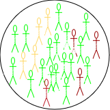

## Preface

This document is prepared for the participants of the Outbreak Analytics
in R course, organized by the Epiverse-TRACE team. Its purpose is to
provide a concise introduction to the mathematical theory behind
modeling infectious epidemics. We will use the Susceptible, Exposed,
Infected, and Recovered (**SEIR**) model, applicable to diseases like
measles, mumps, rubella, as an example.

## Secanrio

Suppose a new infection has been detected in a closed community of
$\mathbf{N}$ individuals, with the infection diagnosed in a single
individual. The remaining $\mathbf{N-1}$ individuals are all at risk of
getting the infection and are considered susceptible ($\mathbf{S}$). An
infected person interacts, on average per time unit (e.g., a day, week,
or month), with some $\mathbf{k}$ individuals within the community. In
particular, the infected person interacts with
$\frac{\mathbf{KS}}{\mathbf{N}}$ susceptible individuals, among whom
$\mathbf{k}' \leq \mathbf{k}$ may become infected. If the infection is
highly contagious, $\mathbf{k}'$ will be closer to $\mathbf{k}$, and
vice versa. The probability of transmission is calculated as
$\mathcal{P}= \frac{\mathbf{k}'}{\mathbf{k}}.$ Consequently, on
average, the infected individual will infect
$\beta\frac{\mathbf{S}}{\mathbf{N}}$ susceptible individuals per time
unit, where $\beta = \mathcal{P}\mathbf{k}$ is called the effective
transmission rate. This represents the average rate at which an infected
individual can transmit the infection to a susceptible individual.

Depending on the nature of the disease, a newly infected individual may
take time to show symptoms. This time period is known as the incubation
period. Susceptible individuals who come into contact with an infected
person and acquire the infection first move to an intermediate state
called exposed ($\mathbf{E}$). There they (he/she) spent, on average,
$\frac{1}{\omega}$ units time (the incubation period) and then move to
the infected class ($\mathbf{I}$) at a constant rate $\omega$. Infected
individuals are removed (either by recovery or death) from $I$ at a
constant rate $\gamma$, with $\frac{1}{\gamma}$ representing the average
recovery duration. Upon recovery, they gain lifelong immunity against
the current infection, meaning they do not become susceptible again, and
they move to the recovered class ($\mathbf{R}$) (see
[Figure 1](#fig-seir){.quarto-xref}).

{ref-parent="fig-seir"}
{ref-parent="fig-seir"}
{ref-parent="fig-seir"}
{ref-parent="fig-seir"}

Figure 1: SEIR model compartments

The four classes considered define the $\mathbf{SEIR}$ model. The sizes
of these classes change overtime and thus are functions of time $t$, and
the total population at any time $t$ is
$N(t)=  S(t) + E(t) + I(t)+ R(t)$. The rates of change between these
classes are captured mathematically through four differential equations
as follows:

[$$
\begin{eqnarray} 
\frac{dS}{dt} &=& -\beta \frac{SI}{N} & &​ \\
\frac{dE}{dt} &=&\beta \frac{SI}{N}​ &-& \omega E\\
\frac{dI}{dt} &=& \omega E &-& \gamma I​ \\
\frac{dR}{dt} &=& \gamma I​  & &\\ 
\end{eqnarray}
 \qquad(1)$$]{#eq-s1}

At time $t_0=0$, there is one infected person ($\mathbf{I}_0 =1$), while
all other individuals remain susceptible
($\mathbf{S}_0= \mathbf{N} -\mathbf{I}_0 = \mathbf{N} -1$). Initially,
there are no exposed or recovered individuals ($\mathbf{E}_0= 0$ and
$\mathbf{R}_0 = 0$). These are known as the initial values of the system
in [Equation 1](#eq-s1){.quarto-xref}.

Solving [Equation 1](#eq-s1){.quarto-xref} involves determining the
values of the compartments at any time $t>t_0$​, starting from the
initial conditions. Since the compartments represent individuals, their
values must always be non-negative. This characteristic is referred to
as the positivity of the solution.

Before, delving into mathematical details of how to solve
[Equation 1](#eq-s1){.quarto-xref}, a few key observations can be made:

1.  The infection will take off only when $\frac{\mathbf{dE}}{dt} > 0$
    and $\frac{\mathbf{dI}}{dt} > 0$, and taking the values of these two
    terms from [Equation 1](#eq-s1){.quarto-xref} leads to

[$$
\begin{eqnarray} 
\beta \frac{SI}{N}​ &-& \omega E > 0\\
 \omega E &-& \gamma I​ > 0.
\end{eqnarray} 
 \qquad(2)$$]{#eq-s2} Adding the two equations in
[Equation 2](#eq-s2){.quarto-xref}, gives
$\frac{\beta}{\gamma} > \frac{\mathbf{N}}{\mathbf{S}}$. At time $t=0$,
we have $\mathbf{S} = \mathbf{N}-1 \approx  \mathbf{N}$. Therefore, the
infection with take off $\frac{\beta}{\gamma} > 1$. This is a very
interesting observation --It tells that the disease cases will increase
if the ratio of new infections to recovered cases is greater than 1.

2.  The ratio $\frac{\beta}{\gamma}$ represents the basic reproduction
    number, $\mathcal{R}_0$, which is defined as the average number of
    new infections caused by a single infected individual in a fully
    susceptible population. $\mathcal{R}_0$ is a crucial metric for
    understanding the transmissibility of an infectious disease. A
    higher value of $\mathcal{R}_0$ indicates a more transmissible
    disease, leading to a faster spread within the community.

3.  At the onset of an epidemic, the number of susceptible individuals
    begins to decrease exponentially, while the number of exposed and
    infectious individuals increases. As the epidemic progresses, the
    susceptible population becomes depleted, and the exposed and
    infectious groups reach their peak before starting to decline.
    Meanwhile, the number of recovered individuals continues to increase
    without decreasing.

## Measles Outbreak in Burkina Faso

### Backaground

Measles is a highly contagious viral disease that spreads quickly,
particularly in environments where people live or gather in close
quarters, such as schools, healthcare facilities, or densely populated
urban areas. Transmission occurs through respiratory droplets when an
infected person coughs or sneezes, and the virus can remain viable in
the air for up to two hours. Effective vaccines are available, offering
an efficacy of 93% to 97%, making vaccination a key tool in controlling
measles outbreaks.

Given the virus's high transmissibility, even a single case of measles
can trigger large outbreaks, especially in regions with low vaccination
coverage. The incubation (pre-infectious) period for measles is
typically around 8 days, [while the infectious period averages 5 days][masters2023measles]. The SEIR model in
[Equation 1](#eq-s1){.quarto-xref} is commonly employed to simulate the
dynamics of measles outbreaks and evaluate control measures like
vaccination

### Burkina Faso Situation in Jan 2024

Burkina Faso, like many other countries in Africa, faces recurring
measles outbreaks. This can be attributed to factors such as limited
healthcare access, inadequate vaccination coverage, and fragile
healthcare systems. In 2023, Burkina Faso experienced a particularly
severe outbreak, [with over 2,000 suspected cases reported][crisis24],
prompting health authorities and international organizations to scale up
[vaccination campaigns in an effort to curtail the spread of the disease][savethechildren, thecable].

We will simulate the measles outbreak in Burkina Faso using the SEIR
model in [Equation 1](#eq-s1){.quarto-xref}. This will allow us to
explore the outbreak dynamics with and without vaccination. For this
purpose, we will use the **R** package `{epidemics}`, which is designed
for modeling infectious disease spread.

### Baseline Model

**Model Assumptions and Parameters**

1.  **Total Population**: The population of Burkina Faso is
    approximately $N\approx 22.67$ million.

2.  **Population Structure**:

    -   **No Age Stratification**: Assume the population is homogeneous
        with respect to age. This means that all individuals, regardless
        of age, have the same susceptibility to measles and contribute
        equally to the transmission dynamics.

    -   **Highly Mixed Community**: Assume the population is well-mixed
        and the transmission occurs uniformly across the entire
        population. Meaning that every individual has an equal
        probability of coming into contact with any other individual.
        This implies that geographic or social structures (like
        clustering within families, schools, or neighborhoods) are not
        considered.

3.  **Initial Conditions**:

    -   A single infectious case is introduced into the population:
        $I_0 = 1$.
    -   The entire population, except for this one case, is initially
        susceptible: $S_0 = N - 1$.
    -   No individuals are in the exposed stage at the start: $E_0 = 0$.
    -   No individuals have recovered: $R_0 = 0$.

4.  **Incubation Period**: The average incubation period for measles is
    around 8 days (the time period between exposure and becoming
    infectious), so the transition rate from exposed to infectious
    individuals is: $\omega = \frac{1}{8}$.

5.  **Infectious Period**: The average infectious period lasts for 5
    days, which means the recovery rate is: $\gamma = \frac{1}{5}$

6.  **Basic Reproduction Number** $\mathcal{R}_0$:

    -   $\mathcal{R}_0 =15$ (for measles this value typically ranges
        from 12 to 18).
    -   This makes the transmission rate
        $\beta = \frac{\mathcal{R}_0}{\gamma} = 3$
    -   This means each infectious individual causes 3 new infections
        per day in a fully susceptible population.

By applying these assumptions and parameters to
[Equation 1](#eq-s1){.quarto-xref}, we can simulate the potential
trajectory of the measles outbreak using the syntax provided by the
{epidemics} package as shown in the below is code chunk.

:::: cell
``` {.r .fold-hide .cell-code}
# Loading libraries
library(dplyr)
library(ggplot2)
library(epidemics)

# Define the population structure for Burkina Faso
bfaso <- population(
  name = "Burkina Faso",
  contact_matrix = matrix(1),  # Well-mixed population
  demography_vector = 22.67e6,  # Population size
  initial_conditions = matrix(
    c(1 - 1/22.67e6, 1/22.67e6, 0, 0, 0),  # Initial conditions: Susceptible, exposed, Infectious, vaccinated, and recovered
    nrow = 1, ncol = 5
  )
)

# Run the SEIR model simulation
output <- model_default(
  population = bfaso,
  transmission_rate = 15/5,  # R0/infectious period = 15/5 = 3
  infectiousness_rate = 1/8,  # 1/incubation period (pre-infectious phase)
  recovery_rate = 1/5,  # 1/infectious period
  time_end = 75,  # Simulation over 75 days
  increment = 1  # Daily increments
)

# Plot the epidemic curve for susceptible, exposed, infectious, and recovered
filter(output, 
       compartment %in% c("exposed", "infectious")) %>%
  ggplot(aes(
    x = time,
    y = value / 10^6,  # Scale to millions
    col = compartment,
    linetype = compartment
  )) +
  geom_line(linewidth = 1.5) +
  theme_bw() +
  theme(
    legend.position = "top"
  ) +
  labs(
    x = "Simulation Time (days)",
    y = "Individuals (in millions)",
    caption = expression(paste("The dynamics of SIER model with ", italic(R)[0], "= 15, ", " showing the trajectories of number of exposed and infected individuals"))
  )
```

::: cell-output-display

:::
::::

### Age-Structured Model

The age structure of Burkina Faso is characteristic of a young
population, with a majority of the population being under 25 years old.
[According to recent estimates][un_population_prospects, cia_world_factbook_bf, world_bank_population_data], the age structure
is broken down as follows:

-   $0\to 14$ years: \~ 44 (43-45)% of the population
-   $15\to 24$ years: \~19.5 (19-20)%
-   $25\to 54$ years: \~29 (28-30)%
-   $55\to 64$ years: \~3.5 (3-4)%
-   **65 years and over**: \~2.5 (2-3)%

##### **Contact Martix**

A contact matrix typically consists of rows and columns representing
different age groups, where each cell indicates the average number of
contacts between individuals of the age group corresponding to that row
and column.

Althought we do not have a direct access for contact matrix for Burkina
Faso, we can resort for a hypothetical contact matrix based on general
assumptions about high contact rates among younger populations and lower
rates among older age groups:

  -----------------------------------------------------------------------
              **0-14      **15-24     **25-54     **55-64     **65+
              years**     years**     years**     years**     years**
  ----------- ----------- ----------- ----------- ----------- -----------
  **0-14      20          10          5           2           1
  years**                                                     

  **15-24     10          15          10          4           2
  years**                                                     

  **25-54     5           10          15          6           3
  years**                                                     

  **55-64     2           4           6           10          5
  years**                                                     

  **65+       1           2           3           5           10
  years**                                                     
  -----------------------------------------------------------------------

  : Table for a **hyoothetical** contact matrix for Burkina Faso
  population.

:::: cell
``` {.r .cell-code}
# Define the contact matrix
contact_matrix <- matrix(
  c(20, 10, 5, 2, 1,   # Contacts from 0-14 years
    10, 15, 10, 4, 2,   # Contacts from 15-24 years
    5, 10, 15, 6, 3,    # Contacts from 25-54 years
    2, 4, 6, 10, 5,     # Contacts from 55-64 years
    1, 2, 3, 5, 10),    # Contacts from 65+ years
  nrow = 5,              # Number of rows
  byrow = TRUE,          # Fill the matrix by rows
  dimnames = list(
    c("0-14", "15-24", "25-54", "55-64", "65+"),
    c("0-14", "15-24", "25-54", "55-64", "65+")
  )
)

# Print the contact matrix
# print(contact_matrix)

# Define the population structure for Burkina Faso
# Initial conditions: one in every 1 million is infected
bf_pop <- 22.67e6
initial_i <- 1 / bf_pop
initial_conditions <- c(S = 1 - initial_i, E = 0, I = initial_i, R = 0, V = 0)

# Replicate initial conditions for all age groups
initial_conditions_matrix <- rbind(
  initial_conditions,
  initial_conditions,
  initial_conditions,
  initial_conditions,
  initial_conditions
)
rownames(initial_conditions_matrix) <- rownames(contact_matrix)
#print(initial_conditions_matrix)

# Define the demography vector for Burkina Faso
demography_vector <- c(0.44, 0.195, 0.29, 0.035, 0.025) * bf_pop
names(demography_vector) <- rownames(contact_matrix)
print(demography_vector)
```

::: {.cell-output .cell-output-stdout}
       0-14   15-24   25-54   55-64     65+ 
    9974800 4420650 6574300  793450  566750 
:::
::::

:::: cell
``` {.r .cell-code}
# Create the population object
bf_population <- population(
  name = "Burkina Faso",
  contact_matrix = contact_matrix,
  demography_vector = demography_vector,
  initial_conditions = initial_conditions_matrix
)

# Run the epidemic model
output <- model_default(
  population = bf_population,
  transmission_rate = 15 / 5,  # R0/infectious period = 15/5 = 3
  infectiousness_rate = 1 / 8,  # 1/incubation period (pre-infectious phase)
  recovery_rate = 1 / 5,  # 1/infectious period
  time_end = 75,  # Simulation over 75 days
  increment = 1  # Daily increments
)

# Plot the epidemic curve
output %>%
  filter(compartment %in% c("exposed", "infectious")) %>%
  ggplot(aes(
    x = time,
    y = value,
    col = demography_group,
    linetype = compartment
  )) +
  geom_line(linewidth = 1.2) +
  scale_y_continuous(labels = scales::comma) +
  scale_colour_brewer(palette = "Dark2", name = "Age group") +
  expand_limits(y = c(0, 500e3)) +
  coord_cartesian(expand = FALSE) +
  theme_bw() +
  theme(
    legend.position = "top",  
    legend.text = element_text(size = 10,hjust = 0, lineheight = 121)
    ) +
  labs(
    x = "Simulation time (days)",
    linetype = "Compartment",
    y = "Individuals",
    caption = expression(paste("SIER model showing the trajectories of the number of exposed and infected individuals ", italic(R)[0], " = 15 for different age groups."))
  ) + 
  guides(
    color = guide_legend(nrow = 2)
    )
```

::: cell-output-display

:::
::::

### Interventions Model

Interventions against measles include prevention, control, and
treatment. Controlling its spread requires a combination of public
health measures, such as reducing contact, isolating infectious and
exposed individuals, and vaccination. In this section, we will simulate
the SEIR model with interventions using the `{epidemics}` package.

#### Modelling the Effect of Contacts Reduction

Reducing contact by a certain percentage, say ( 20% ), impacts the
transmission rate $( \beta )$. This reduction can be achieved through
measures such as quarantine, limiting public gatherings, and regular
screening in healthcare settings. To include such interventions in the
baseline SEIR model, the `{epidemics}` package provides an object called
`interventions`, which is added to the model definition as shown in the
code chunk below.

::: cell
``` {.r .cell-code}
reduced_contacts <- intervention(
  name = "reduce",
  type = "rate",
  time_begin = 30,
  time_end = 30 + 30,
  reduction = 0.2
)

# Run the epidemic model
output2 <- epidemics::model_default(
  population = bf_population,
  transmission_rate = 15 / 5,  # R0/infectious period = 15/5 = 3
  infectiousness_rate = 1 / 8,  # 1/incubation period (pre-infectious phase)
  recovery_rate = 1 / 5,  # 1/infectious period
  intervention = list(transmission_rate = reduced_contacts),
  time_end = 75,  # Simulation over 75 days
  increment = 1  # Daily increments
)
```
:::

To examine the effect that implementing a reduction in contact has on
the daily number of new infections, we plot the results from the two
models.

:::: cell
``` {.r .cell-code}
# Load new infections data for each scenario
data_baseline <- new_infections(output, by_group = TRUE)
data_reduced <- new_infections(output2, by_group = TRUE)

# Assign scenario names
data_baseline$scenario <- "Baseline"
data_reduced$scenario <- "Reduced Contact"

# Combine the data from both scenarios
data_combined <- bind_rows(data_baseline, data_reduced)

# Plot new infections over time with scenario and demographic groups
ggplot(data_combined) +
  geom_line(
    aes(x = time, y = new_infections, col = demography_group, linetype = scenario)
  ) +
  # Highlight the reduced contact intervention period
  annotate(
    geom = "rect",
    xmin = reduced_contacts[["time_begin"]],
    xmax = reduced_contacts[["time_end"]],
    ymin = 0, ymax = 0.67e6,
    fill = alpha("red", 0.2),
    linetype = "dashed"
  ) +
  # Set axis scaling and formatting
  scale_y_continuous(labels = scales::comma) +
  scale_linetype_manual(
    name = "Scenario",
    values = c(
      "Baseline" = "dashed",
      "Reduced Contact" = "solid"
    )
  ) +
  scale_colour_brewer(
    palette = "Dark2",
    name = "Age Group"
  ) +
  expand_limits(y = c(0, 100e3)) +
  coord_cartesian(expand = FALSE) +
  theme_bw() +
  theme(
    legend.position = "top"
  ) +
  labs(
    x = "Simulation Time (days)",
    y = "New Infections",
    linetype = "Scenario", 
    caption = expression(paste("New infections under baseline and 20% reduced transmission rate (", beta, ") for different age groups."))
  ) + 
  # Adjust legend display to fit in two rows
  guides(
    color = guide_legend(nrow = 2)
  )
```

::: cell-output-display

:::
::::

#### Modelling the effect of vaccination

An effective vaccine for measles exists, known as the measles, mumps,
and rubella (MMR) vaccine. The efficacy of the measles component of the
MMR vaccine varies slightly depending on the age at which it is
administered and the number of doses received. For example, the
vaccine's efficacy is approximately $93\%$, $97\%$, $95\%$, $94\%$, and
$85\%$ for the age groups $0\to 14$, $15\to 24$, $25\to 54$, $55\to 64$,
and $65+$, respectively. The `{epidemics}` package enables the
incorporation of vaccination interventions into modeling, as
demonstrated in the code chunk below.

:::: cell
``` {.r .cell-code}
vaccinate_elders <- vaccination(
  name = "Vaccination compagain",
  time_begin = matrix(30, nrow(contact_matrix)),
  time_end = matrix(60, nrow(contact_matrix)),
  nu = matrix(c(0.93, 0.97, 0.95, 0.90, 0.95 ))
)

# Run the epidemic model
output3 <- epidemics::model_default(
  population = bf_population,
  transmission_rate = 15 / 5,  # R0/infectious period = 15/5 = 3
  infectiousness_rate = 1 / 8,  # 1/incubation period (pre-infectious phase)
  recovery_rate = 1 / 5,  # 1/infectious period
  vaccination = vaccinate_elders,
  time_end = 75,  # Simulation over 75 days
  increment = 1  # Daily increments
)

# Plot the epidemic curve
output3 %>%
  filter(compartment %in% c("exposed", "infectious")) %>%
  ggplot(aes(
    x = time,
    y = value,
    col = demography_group,
    linetype = compartment
  )) +
  geom_line(linewidth = 1.2) +
  scale_y_continuous(labels = scales::comma) +
  scale_colour_brewer(palette = "Dark2", name = "Age group") +
  expand_limits(y = c(0, 500e3)) +
  coord_cartesian(expand = FALSE) +
  theme_bw() +
  theme(
    legend.position = "top",  
    legend.text = element_text(size = 10,hjust = 0, lineheight = 121)
    ) +
  labs(
    x = "Simulation time (days)",
    linetype = "Compartment",
    y = "Individuals",
    caption = expression(paste("SIER with vaccine  showing the trajectories of the number of exposed and infected individuals for different age groups."))
  ) + 
  guides(
    color = guide_legend(nrow = 2)
    )
```

::: cell-output-display

:::
::::

We can visualize the outcomes of both the baseline model and the
vaccine-intervention model to highlight the differences in infection
dynamics. This comparison allows us to observe how vaccination impacts
the spread of the disease, particularly in terms of reducing new
infections, altering the epidemic curve, and potentially preventing
outbreaks across different age groups. By contrasting these two models,
we can better understand the effectiveness of vaccination strategies in
controlling the epidemic.

:::: cell
``` {.r .cell-code}
# Load new infections data for each scenario
data_vaccine <- new_infections(output3, by_group = TRUE)

# Assign scenario names
data_vaccine$scenario <- "Vaccination"

# Combine the data from both scenarios (baseline and vaccination)
data_combined <- bind_rows(data_baseline, data_vaccine)

# Plot new infections over time by scenario and demographic groups
ggplot(data_combined) +
  # Plot new infections with lines for each demographic group and scenario
  geom_line(
    aes(x = time, y = new_infections, col = demography_group, linetype = scenario)
  ) +
  
  # Highlight the reduced contact intervention period using a shaded rectangle
  annotate(
    geom = "rect",
    xmin = reduced_contacts[["time_begin"]],
    xmax = reduced_contacts[["time_end"]],
    ymin = 0, ymax = 0.67e6,  # Define the rectangle's limits
    fill = alpha("red", 0.2),  # Semi-transparent red fill
    linetype = "dashed"  # Dashed border for the rectangle
  ) +
  
  # Scale the y-axis with comma-formatted labels
  scale_y_continuous(labels = scales::comma) +
  
  # Define custom line types for scenarios
  scale_linetype_manual(
    name = "Scenario",
    values = c(
      "Baseline" = "dashed",
      "Vaccination" = "solid"
    )
  ) +
  
  # Use a color palette for age groups
  scale_colour_brewer(
    palette = "Dark2",
    name = "Age Group"
  ) +
  
  # Set axis limits and disable automatic expansion
  expand_limits(y = c(0, 100e3)) +
  coord_cartesian(expand = FALSE) +
  
  # Apply a clean white background theme
  theme_bw() +
  
  # Customize theme for better aesthetics
  theme(
    legend.position = "top",  # Position legend at the top
    legend.text = element_text(size = 10),  # Adjust legend text size
    plot.caption = element_text(hjust = 0.5)  # Center align the caption
  ) +
  
  # Add axis labels and caption for the plot
  labs(
    x = "Simulation Time (days)",  # x-axis label
    y = "New Infections",  # y-axis label
    linetype = "Scenario",  # Legend title for line types
    caption = expression(paste("New infections under baseline and vaccine-induced immunity with varying efficacy (", nu, ") across different age groups."))
  ) +
  
  # Adjust legend display for better readability
  guides(
    color = guide_legend(nrow = 2)  # Split legend into two rows
  )
```

::: cell-output-display

:::
::::

#### Combining interventions

The `{epidemics}` package enables the integration of multiple
interventions, such as vaccination and contact reduction, within a
single model, allowing for more comprehensive simulations of disease
control strategies. The below code chunk shows how to combine
interventions together.

:::: cell
``` {.r .cell-code}
# Run the epidemic model
output4 <- epidemics::model_default(
  population = bf_population,
  transmission_rate = 15 / 5,  # R0 / infectious period = 3
  infectiousness_rate = 1 / 8,  # 1 / incubation period (pre-infectious phase)
  recovery_rate = 1 / 5,  # 1 / infectious period
  intervention = list(transmission_rate = reduced_contacts),
  vaccination = vaccinate_elders,
  time_end = 75,  # Simulation over 75 days
  increment = 1  # Daily increments
)

# Plot the epidemic curve (infectious individuals)
output4 %>%
  filter(compartment == "infectious") %>%  # Filter for infectious individuals
  ggplot(aes(
    x = time,  # Time on the x-axis
    y = value,  # Number of infectious individuals on the y-axis
    col = demography_group  # Color by demographic group (age)
  )) +
  geom_line(linewidth = 1.2) +  # Line width for better visibility
  scale_y_continuous(labels = scales::comma) +  # Format y-axis with commas for thousands
  scale_colour_brewer(palette = "Dark2", name = "Age Group") +  # Color palette for age groups
  expand_limits(y = c(0, 250e3)) +  # Ensure the y-axis starts from 0 and goes up to 500,000
  coord_cartesian(expand = FALSE) +  # Disable axis expansion
  theme_bw() +  # Clean, white background theme
  theme(
    legend.position = "top",  # Place legend at the top
    legend.text = element_text(size = 10, hjust = 0, lineheight = 1.1),  # Adjust text size and line height
    plot.caption = element_text(hjust = 0.5)  # Center align the caption
  ) +
  labs(
    x = "Simulation Time (Days)",  # x-axis label
    y = "Number of Infectious Individuals",  # y-axis label
    caption = "SIER model with vaccination and contact reduction: Number of infectious individuals by age group"
  ) +
  guides(
    color = guide_legend(nrow = 2)  # Split the legend into two rows for compactness
  )
```

::: cell-output-display

:::
::::


[masters2023measles]: https://www.thelancet.com/journals/lanpub/article/PIIS2468-2667(23)00255-5/fulltext "Measles virus transmission patterns and public health responses during Operation Allies Welcome: a descriptive epidemiological study"
[savethechildren]: https://www.savethechildren.net/news/burkina-faso-over-2000-children-diagnosed-suspected-measles-nationwide-outbreak "BURKINA FASO: Over 2,000 children diagnosed with suspected measles in nationwide outbreak"
[thecable]: https://www.thecable.ng/burkina-faso-records-2000-suspected-cases-as-country-battles-measles-outbreak/ "Burkina Faso records 2,000 suspected cases as country battles measles outbreak"
[crisis24]: https://crisis24.garda.com/alerts/2024/02/burkina-faso-elevated-measles-activity-reported-in-multiple-areas-in-february "Burkina Faso: Elevated measles activity reported in multiple areas in February"
[un_population_prospects]: https://population.un.org/wpp/ "World Population Prospects"
[world_bank_population_data]: https://data.worldbank.org/indicator/SP.POP.TOTL?locations=BF "Population Data - Burkina Faso"
[cia_world_factbook_bf]: https://www.cia.gov/the-world-factbook/countries/burkina-faso/ "The World Factbook - Burkina Faso"

