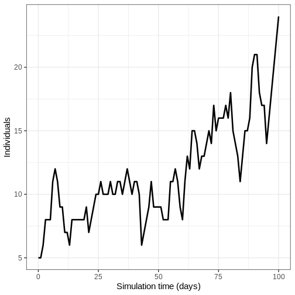
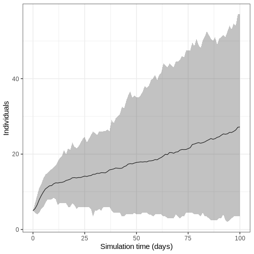

:::::::::::::::::::::::::::::::::::::: questions 

- How do I choose a mathematical model that's appropriate to complete my analytical task?


::::::::::::::::::::::::::::::::::::::::::::::::

::::::::::::::::::::::::::::::::::::: objectives

- Understand the model requirements for a specific research question

::::::::::::::::::::::::::::::::::::::::::::::::

::::::::::::::::::::::::::::::::::::: prereq

+ Complete tutorial [Simulating transmission](../episodes/simulating-transmission.md)
:::::::::::::::::::::::::::::::::


## Introduction

There are existing mathematical models for different infections, interventions and transmission patterns which can be used to answer new questions. In this tutorial, we will learn how to choose an existing model to complete a given task.

:::::::::::::::::::::::::::::::::::::::::::::::::::::::::::::::::::: instructor

The focus of this tutorial is understanding existing models to decide if they are appropriate for a defined question. 

::::::::::::::::::::::::::::::::::::::::::::::::::::::::::::::::::::::::::::::::

::::::::::::::::::::::::::::::::::::::: discussion

### Choosing a model 

When deciding which mathematical model to use, there are a number of questions we must consider :

:::::::::::::::::::::::::::::::::::::::::::::::::::

:::::::::::::::: solution

### What is the infection/disease of interest? 

A model may already exist for your study disease, or there may be a model for an infection that has similar transmission pathways and epidemiological features that can be adapted. For example, diseases with similar transmission routes (e.g., airborne, droplet, or contact transmission) and similar natural history (e.g., incubation period, infectious period) may use similar model structures.

:::::::::::::::::::::::::

:::::::::::::::: solution

### Do we need a [deterministic](../learners/reference.md#deterministic) or [stochastic](../learners/reference.md#stochastic) model? 

Model structures differ depending on the scale and nature of the outbreak. When simulated numbers of infection are small, stochastic variation (i.e. randomness that we can define mathematically) in output can significantly affect whether an outbreak takes off or not. Outbreaks, which are typically localized events, may be better modeled using stochastic approaches to capture the uncertainty in early transmission dynamics. Epidemics, which are larger-scale events, can often be effectively modeled using deterministic approaches as the stochastic variation becomes less significant relative to the overall dynamics. It's important to note that the terms "outbreak" and "epidemic" can sometimes be used interchangeably depending on context, with outbreaks sometimes being considered as localized epidemics.

:::::::::::::::::::::::::

:::::::::::::::: solution

## What is the outcome of interest?

The outcome of interest is typically a measurable quantity derived from the mathematical model. This could include:

- The number of infections over time
- The peak number of hospitalizations
- The total number of severe disease cases
- The final size of the epidemic
- The timing of epidemic peaks

:::::::::::::::::::::::::

:::::::::::::::: solution

## How is transmission modelled?

For example, [direct](../learners/reference.md#direct) or [indirect](../learners/reference.md#indirect), [airborne](../learners/reference.md#airborne) or [vector-borne](../learners/reference.md#vectorborne).
:::::::::::::::::::::::::


:::::::::::::::: solution

## How are the different processes (e.g. transmission) formulated in the equations?

There can be subtle differences in model structures for the same infection or outbreak type which can be missed without studying the equations. For example, transmissibility parameters can be specified as rates or probabilities. If you want to use parameter values from other published models, you must check that transmission is formulated in the same way. 
:::::::::::::::::::::::::

:::::::::::::::: solution

## Will any interventions be modelled? 

Finally, interventions such as vaccination, social distancing, or treatment programs may be of interest. Different models have varying capabilities to incorporate interventions:

- Some models can simulate continuous interventions (e.g., ongoing vaccination programs)
- Others handle discrete interventions (e.g., one-time school closures)
- Some models may not include intervention capabilities at all

We discuss interventions in detail in the tutorial [Modelling interventions](../episodes/modelling-interventions.md).

:::::::::::::::::::::::::


## Available  models in `{epidemics}`
 
The R package `{epidemics}` contains functions to run existing models.
For details on the models that are available, see the package [Reference Guide of "Model functions"](https://epiverse-trace.github.io/epidemics/reference/index.html#model-functions). All model function names start with `model_*()`. To learn how to run the models in R, read the [Vignettes on "Guides to library models"](https://epiverse-trace.github.io/epidemics/articles/#guides-to-library-models). 


::::::::::::::::::::::::::::::::::::: challenge

## What model?

You have been asked to explore the variation in numbers of infectious individuals in the early stages of an Ebola outbreak. 

Which of the following models would be an appropriate choice for this task:

+  `model_default()`

+ `model_ebola()`

::::::::::::::::: hint

Consider the following questions:

::::::::::::::::::::::::::::::::::::: checklist

+ What is the infection/disease of interest? 
+ Do we need a deterministic or stochastic model? 
+ What is the outcome of interest?
+ Will any interventions be modelled? 

::::::::::::::::::::::::::::::::::::::::::::::::


::::::::::::::::::::::


::::::::::::::::: solution

+ What is the infection/disease of interest? **Ebola**
+ Do we need a deterministic or stochastic model?  **A stochastic model would allow us to explore variation in the early stages of the outbreak**
+ What is the outcome of interest? **Number of infections**
+ Will any interventions be modelled? **No**

#### `model_default()`

A deterministic SEIR model with age specific direct transmission. 


The model is capable of simulating an Ebola type outbreak, but as the model is deterministic, we are not able to explore stochastic variation in the early stages of the outbreak.


#### `model_ebola()`

A stochastic SEIHFR (Susceptible, Exposed, Infectious, Hospitalised, Funeral, Removed) model that was developed specifically for Ebola virus disease. The model includes unique compartments for Hospitalised and Funeral states, which are critical for understanding Ebola transmission dynamics due to the high risk of transmission in healthcare settings and during traditional burial practices. The model has stochasticity in the passage times between states, which are modelled as Erlang distributions.

The key parameters affecting the transition between states are:

+ $R_0$, the basic reproduction number,
+ $\rho^I$, the mean infectious period,
+ $\rho^E$, the mean preinfectious period,
+ $p_{hosp}$ the probability of being transferred to the hospitalised compartment. 

**Note: the functional relationship between the preinfectious  period ($\rho^E$) and the transition rate between exposed and infectious ($\gamma^E$) is $\rho^E = k^E/\gamma^E$ where $k^E$ is the shape of the Erlang distribution. Similarly for the infectious period $\rho^I = k^I/\gamma^I$. For more detail on the stochastic model formulation refer to the section on [Discrete-time Ebola virus disease model](https://epiverse-trace.github.io/epidemics/articles/model_ebola.html#details-discrete-time-ebola-virus-disease-model) in the "Modelling responses to a stochastic Ebola virus epidemic" vignette. ** 


The model has additional parameters describing the transmission risk in hospital and funeral settings: 

+ $p_{ETU}$, the proportion of hospitalised cases contributing to the infection of susceptibles (ETU = Ebola virus treatment units),
+ $p_{funeral}$, the proportion of funerals at which the risk of transmission is the same as of infectious individuals in the community.

As this model is stochastic, it is the most appropriate choice to explore how variation in numbers of infected individuals in the early stages of an Ebola outbreak. 


:::::::::::::::::::::::::::


::::::::::::::::::::::::::::::::::::::::::::::::


::::::::::::::::::::::::::::::::::::: callout
### Do I need to use a mathematical model?

Mathematical models can be used to generate disease trajectories, which can then be used to calculate the final size of the epidemic. If you are only interested in the final size, it is possible to use mathematical theory to calculate this quantity directly, without having to simulate the full model then work out how many individuals were infected. These mathematical calculations are performed using R functions in the package `{finalsize}`.

An advantage of using `finalsize` is that fewer parameters are required. You only need to define transmissibility and the susceptibility of the population, and a social contact matrix if relevant, rather than parameters like infectious period that are required in {epidemics} to simulate dynamics over time. Check out the [package vignettes](https://epiverse-trace.github.io/finalsize/articles/finalsize.html) for more information on how to use `finalsize` to calculate epidemic size. 

::::::::::::::::::::::::::::::::::::::::::::::::


## Challenge : Ebola outbreak analysis 


::::::::::::::::::::::::::::::::::::: challenge

## Running the model

You have been tasked to generate initial trajectories of an Ebola outbreak in Guinea. Using `model_ebola()` and the the information detailed below, complete the following tasks:

1. Run the model once and plot the number of infectious individuals  through time
2. Run model 100 times and plot the mean, upper and lower 95% quantiles of the number of infectious individuals through time

+ Population size : 14 million
+ Initial number of exposed individuals : 10
+ Initial number of infectious individuals : 5
+ Time of simulation : 120 days
+ Parameter values : 
  + $R_0$ (`r0`) = 1.1,
  + $p^I$ (`infectious_period`) = 12,
  + $p^E$ (`preinfectious_period`) = 5,
  + $k^E=k^I = 2$, 
  + $1-p_{hosp}$ (`prop_community`) = 0.9,
  + $p_{ETU}$ (`etu_risk`) = 0.7,
  + $p_{funeral}$ (`funeral_risk`) = 0.5

::::::::::::::::: hint

### Code for initial conditions 


``` r
# set population size
population_size <- 14e6

E0 <- 10
I0 <- 5
# prepare initial conditions as proportions
initial_conditions <- c(
  S = population_size - (E0 + I0), E = E0, I = I0, H = 0, F = 0, R = 0
) / population_size

guinea_population <- population(
  name = "Guinea",
  contact_matrix = matrix(1), # note dummy value
  demography_vector = population_size, # 14 million, no age groups
  initial_conditions = matrix(
    initial_conditions,
    nrow = 1
  )
)
```


::::::::::::::::::::::


::::::::::::::::: hint

### HINT : Multiple model simulations

Adapt the code from the [accounting for uncertainty](../episodes/simulating-transmission.md#accounting-for-uncertainty) section

::::::::::::::::::::::

::::::::::::::::: solution

1. Run the model once and plot the number of infectious individuals  through time


``` r
output <- model_ebola(
  population = guinea_population,
  transmission_rate = 1.1 / 12,
  infectiousness_rate = 2.0 / 5,
  removal_rate = 2.0 / 12,
  prop_community = 0.9,
  etu_risk = 0.7,
  funeral_risk = 0.5,
  time_end = 100,
  replicates = 1 # replicates argument
)

output %>%
  filter(compartment == "infectious") %>%
  ggplot() +
  geom_line(
    aes(time, value),
    linewidth = 1.2
  ) +
  scale_y_continuous(
    labels = scales::comma
  ) +
  labs(
    x = "Simulation time (days)",
    y = "Individuals"
  ) +
  theme_bw(
    base_size = 15
  )
```



2. Run model 100 times and plot the mean, upper and lower 95% quantiles of the number of infectious individuals through time

We run the model 100 times with the *same* parameter values. 


``` r
output_replicates <- model_ebola(
  population = guinea_population,
  transmission_rate = 1.1 / 12,
  infectiousness_rate = 2.0 / 5,
  removal_rate = 2.0 / 12,
  prop_community = 0.9,
  etu_risk = 0.7,
  funeral_risk = 0.5,
  time_end = 100,
  replicates = 100 # replicates argument
)

output_replicates %>%
  filter(compartment == "infectious") %>%
  ggplot(
    aes(time, value)
  ) +
  stat_summary(geom = "line", fun = mean) +
  stat_summary(
    geom = "ribbon",
    fun.min = function(z) {
      quantile(z, 0.025)
    },
    fun.max = function(z) {
      quantile(z, 0.975)
    },
    alpha = 0.3
  ) +
  labs(
    x = "Simulation time (days)",
    y = "Individuals"
  ) +
  theme_bw(
    base_size = 15
  )
```



:::::::::::::::::::::::::::


::::::::::::::::::::::::::::::::::::::::::::::::


::::::::::::::::::::::::::::::::::::: keypoints 

- Existing mathematical models should be selected according to the research question
- It is important to check that a model has appropriate assumptions about transmission, outbreak potential, outcomes and interventions 
::::::::::::::::::::::::::::::::::::::::::::::::
