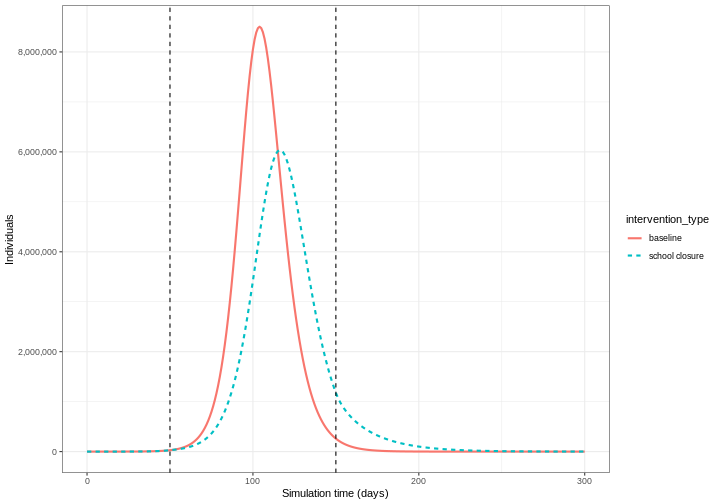
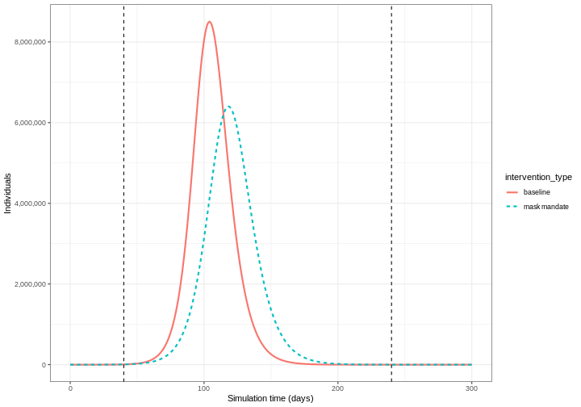
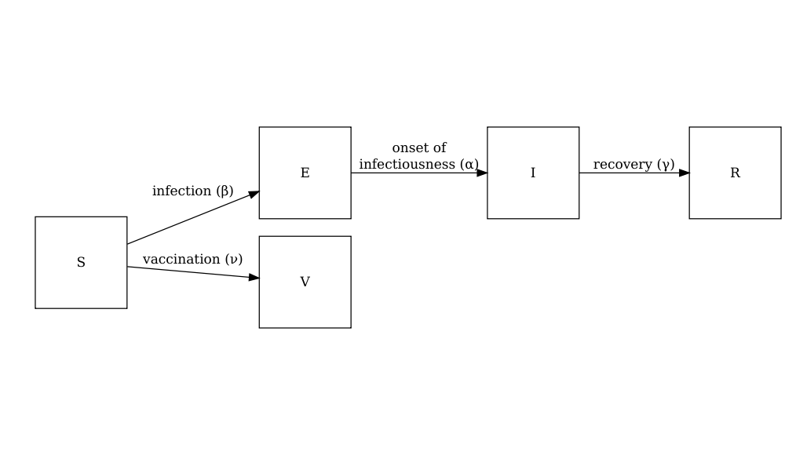
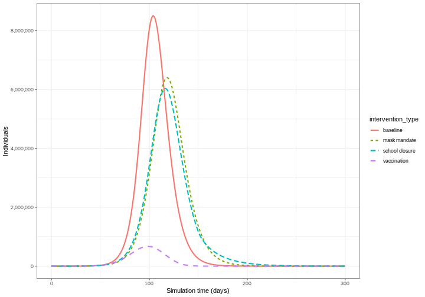

:::::::::::::::::::::::::::::::::::::: questions 

- How do I investigate the effect of interventions on disease trajectories? 


::::::::::::::::::::::::::::::::::::::::::::::::

::::::::::::::::::::::::::::::::::::: objectives

- Add pharmaceutical and non-pharmaceutical interventions to `{epidemics}` model

::::::::::::::::::::::::::::::::::::::::::::::::

::::::::::::::::::::::::::::::::::::: prereq

## Prerequisites
+ Complete tutorial on [Simulating transmission](../episodes/simulating-transmission.md).

Learners should also familiarise themselves with following concept dependencies before working through this tutorial: 

**Outbreak response** : [Intervention types](https://www.cdc.gov/nonpharmaceutical-interventions/).
:::::::::::::::::::::::::::::::::


## Introduction

Mathematical models can be used to generate trajectories of disease spread under the implementation of interventions at different stages of an outbreak. These trajectories can be used to make decisions on what interventions could be implemented to slow down the spread of diseases. 

Interventions are usually incorporated into mathematical models via manipulating values of relevant parameters, e.g., reduce transmission, or via introducing a new disease state, e.g., vaccinated class where we assume individuals belong to this class are no longer susceptible to infection.

In this tutorial we are going to learn how to use the `{epidemics}` package to model interventions and access to social contact data with `{socialmixr}`. We'll use `{dplyr}`, `{ggplot2}` and the pipe `%>%` to connect some of their functions, so let's also call to the `{tidyverse}` package:


```r
library(epidemics)
library(socialmixr)
library(tidyverse)
```


:::::::::::::::::::::::::::::::::::::::::::::::::::::::::::::::::::: instructor

In this tutorial different types of intervention and how they can be modelled are introduced. Learners should be able to understand the underlying mechanism of these interventions (e.g. reduce contact rate) as well as how to implement the code to include such interventions.

::::::::::::::::::::::::::::::::::::::::::::::::::::::::::::::::::::::::::::::::

## Non-pharmaceutical interventions

[Non-pharmaceutical interventions](../learners/reference.md#NPIs) (NPIs) are measures put in place to reduce transmission that do not include the administration of drugs or vaccinations. NPIs aim at reducing contacts between infectious and susceptible individuals by closure of schools and workplaces, and other measures to prevent the spread of the disease,  for example, washing hands and wearing masks.

We will investigate the effect of interventions on a COVID-19 outbreak using an SEIR model (`model_default()` in the R package `{epidemics}`). We will set $R_0 = 2.7$, latent period or pre-infectious period $= 4$ and the infectious period $= 5.5$ (parameters adapted from [Davies et al. (2020)](https://doi.org/10.1016/S2468-2667(20)30133-X)). We adopt a contact matrix with age bins 0-18, 18-65, 65 years and older using `{socialmixr}`, and assume that one in every 1 million in each age group is infectious at the start of the epidemic.


```r
polymod <- socialmixr::polymod
contact_data <- socialmixr::contact_matrix(
  polymod,
  countries = "United Kingdom",
  age.limits = c(0, 15, 65),
  symmetric = TRUE
)

# prepare contact matrix
contact_matrix <- t(contact_data$matrix)

# prepare the demography vector
demography_vector <- contact_data$demography$population
names(demography_vector) <- rownames(contact_matrix)

# initial conditions: one in every 1 million is infected
initial_i <- 1e-6
initial_conditions <- c(
  S = 1 - initial_i, E = 0, I = initial_i, R = 0, V = 0
)

# build for all age groups
initial_conditions <- matrix(
  rep(initial_conditions, dim(contact_matrix)[1]),
  ncol = 5, byrow = TRUE
)
rownames(initial_conditions) <- rownames(contact_matrix)

# prepare the population to model as affected by the epidemic
uk_population <- epidemics::population(
  name = "UK",
  contact_matrix = contact_matrix,
  demography_vector = demography_vector,
  initial_conditions = initial_conditions
)
```

#### Effect of school closures on COVID-19 spread

The first NPI we will consider is the effect of school closures on reducing the number of individuals infectious with COVID-19 through time. We assume that a school closure will reduce the frequency of contacts within and between different age groups. We assume that school closures will reduce the contacts between school aged children (aged 0-15) by 0.5, and will cause a small reduction (0.01) in the contacts between adults (aged 15 and over). 

To include an intervention in our model we must create an `intervention` object. The inputs are the name of the intervention (`name`), the type of intervention (`contacts` or `rate`), the start time (`time_begin`), the end time (`time_end`) and the reduction (`reduction`). The values of the reduction matrix are specified in the same order as the age groups in the contact matrix. 


```r
rownames(contact_matrix)
```

```{.output}
[1] "[0,15)"  "[15,65)" "65+"    
```

Therefore, we specify ` reduction = matrix(c(0.5, 0.01, 0.01))`. We assume that the school closures start on day 50 and continue to be in place for a further 100 days. Therefore our intervention object is: 


```r
close_schools <- intervention(
  name = "School closure",
  type = "contacts",
  time_begin = 50,
  time_end = 50 + 100,
  reduction = matrix(c(0.5, 0.01, 0.01))
)
```

::::::::::::::::::::::::::::::::::::: callout
### Effect of interventions on contacts

In `{epidemics}`, the contact matrix is scaled down by proportions for the period in which the intervention is in place. To understand how the reduction is calculated within the model functions, consider a contact matrix for two age groups with equal number of contacts:


```{.output}
     [,1] [,2]
[1,]    1    1
[2,]    1    1
```

If the reduction is 50% in group 1 and 10% in group 2, the contact matrix during the intervention will be:


```{.output}
     [,1] [,2]
[1,] 0.25 0.45
[2,] 0.45 0.81
```

The contacts within group 1 are reduced by 50% twice to accommodate for a 50% reduction in outgoing and incoming contacts ($1\times 0.5 \times 0.5 = 0.25$). Similarly, the contacts within group 2 are reduced by 10% twice. The contacts between group 1 and group 2 are reduced by 50% and then by 10% ($1 \times 0.5 \times 0.9= 0.45$). 

::::::::::::::::::::::::::::::::::::::::::::::::

Using transmission rate $= 2.7/5.5$ (remember that [transmission rate = $R_0$/ infectious period](../episodes/simulating-transmission.md#the-basic-reproduction-number-r_0)), infectiousness rate $1/= 4$ and the recovery rate $= 1/5.5$ we run the model with ` intervention = list(contacts = close_schools)` as follows:


```r
# time periods
preinfectious_period <- 4.0
infectious_period <- 5.5
basic_reproduction <- 2.7

# rates
infectiousness_rate <- 1.0 / preinfectious_period
recovery_rate <- 1.0 / infectious_period
transmission_rate <- basic_reproduction / infectious_period
```


```r
output_school <- model_default(
  # population
  population = uk_population,
  # rate
  transmission_rate = transmission_rate,
  infectiousness_rate = infectiousness_rate,
  recovery_rate = recovery_rate,
  # intervention
  intervention = list(contacts = close_schools),
  # time
  time_end = 300, increment = 1.0
)
```


To be able to see the effect of our intervention, we also run a baseline variant of the model, i.e,  without intervention, combine the two outputs into one data frame, and then plot the output. Here we plot the total number of infectious individuals in all age groups using `ggplot2::stat_summary()` function:


```r
# run baseline simulation with no intervention
output_baseline <- model_default(
  population = uk_population,
  transmission_rate = transmission_rate,
  infectiousness_rate = infectiousness_rate,
  recovery_rate = recovery_rate,
  time_end = 300, increment = 1.0
)

# create intervention_type column for plotting
output_school$intervention_type <- "school closure"
output_baseline$intervention_type <- "baseline"
output <- rbind(output_school, output_baseline)

library(tidyverse)

output %>%
  filter(compartment == "infectious") %>%
  ggplot() +
  aes(
    x = time,
    y = value,
    color = intervention_type,
    linetype = intervention_type
  ) +
  stat_summary(
    fun = "sum",
    geom = "line",
    linewidth = 1
  ) +
  scale_y_continuous(
    labels = scales::comma
  ) +
  geom_vline(
    xintercept = c(
      close_schools$time_begin,
      close_schools$time_end
    ),
    linetype = 2
  ) +
  theme_bw() +
  labs(
    x = "Simulation time (days)",
    y = "Individuals"
  )
```


We can see that with the intervention in place, the infection still spreads through the population and hence accumulation of immunity contributes to the eventual peak-and-decline. However, the peak number of infectious individuals is smaller (green dashed line) than the baseline with no intervention in place (red solid line).


#### Effect of mask wearing on COVID-19 spread

We can also model the effect of other NPIs by reducing the value of the relevant parameters. For example,  investigating the effect of mask wearing on the number of individuals infectious with COVID-19 through time. 

We expect that mask wearing will reduce an individual's infectiousness. As we are using a population based model, we cannot make changes to individual behaviour and so assume that the transmission rate $\beta$ is reduced by a proportion due to mask wearing in the population. We specify this proportion, $\theta$ as product of the proportion wearing masks multiplied by the proportion reduction in transmission rate (adapted from [Li et al. 2020](https://doi.org/10.1371/journal.pone.0237691)).

We create an intervention object with `type = rate` and `reduction = 0.161`. Using parameters adapted from [Li et al. 2020](https://doi.org/10.1371/journal.pone.0237691) we have proportion wearing masks = coverage $\times$ availability = $0.54 \times 0.525 = 0.2835$ and proportion reduction in transmission rate = $0.575$. Therefore, $\theta = 0.2835 \times 0.575 = 0.163$. We assume that the mask wearing mandate starts at day 40 and continue to be in place for 200 days.


```r
mask_mandate <- intervention(
  name = "mask mandate",
  type = "rate",
  time_begin = 40,
  time_end = 40 + 200,
  reduction = 0.163
)
```

To implement this intervention on the transmission rate $\beta$, we specify `intervention = list(transmission_rate = mask_mandate)`.


```r
output_masks <- model_default(
  # population
  population = uk_population,
  # rate
  transmission_rate = transmission_rate,
  infectiousness_rate = infectiousness_rate,
  recovery_rate = recovery_rate,
  # intervention
  intervention = list(transmission_rate = mask_mandate),
  # time
  time_end = 300, increment = 1.0
)
```


```r
# create intervention_type column for plotting
output_masks$intervention_type <- "mask mandate"
output_baseline$intervention_type <- "baseline"
output <- rbind(output_masks, output_baseline)

output %>%
  filter(compartment == "infectious") %>%
  ggplot() +
  aes(
    x = time,
    y = value,
    color = intervention_type,
    linetype = intervention_type
  ) +
  stat_summary(
    fun = "sum",
    geom = "line",
    linewidth = 1
  ) +
  scale_y_continuous(
    labels = scales::comma
  ) +
  geom_vline(
    xintercept = c(
      mask_mandate$time_begin,
      mask_mandate$time_end
    ),
    linetype = 2
  ) +
  theme_bw() +
  labs(
    x = "Simulation time (days)",
    y = "Individuals"
  )
```



::::::::::::::::::::::::::::::::::::: callout
### Intervention types

There are two intervention types for `model_default()`. Rate interventions on model parameters (`transmission_rate` $\beta$, `infectiousness_rate` $\sigma$ and `recovery_rate` $\gamma$) and contact matrix reductions (`contacts`).

To implement both contact and rate interventions in the same simulation they must be passed as a list, e.g., `intervention = list(transmission_rate = mask_mandate, contacts = close_schools)`. But if there are multiple interventions that target contact rates, these must be passed as one `contacts` input. See the [vignette on modelling overlapping interventions](https://epiverse-trace.github.io/epidemics/articles/modelling_multiple_interventions.html) for more detail. 

::::::::::::::::::::::::::::::::::::::::::::::::


## Pharmaceutical interventions

Pharmaceutical interventions (PIs) are measures such as vaccination and mass treatment programs. In the previous section, we integrated the interventions into the model by reducing  parameter values during specific period of time window in which these intervention set to take place. In the case of vaccination, we assume that after the intervention individuals are no longer susceptible and should be classified into a different disease state. Therefore, we specify the rate at which individuals are vaccinated and track the number of vaccinated individuals over time. 

The diagram below shows the SEIRV model implemented using `model_default()` where susceptible individuals are vaccinated and then move to the $V$ class.




The equations describing this model are as follows: 

$$
\begin{aligned}
\frac{dS_i}{dt} & = - \beta S_i \sum_j C_{i,j} I_j -\nu_{t} S_i \\
\frac{dE_i}{dt} &= \beta S_i\sum_j C_{i,j} I_j - \alpha E_i \\
\frac{dI_i}{dt} &= \alpha E_i - \gamma I_i \\
\frac{dR_i}{dt} &=\gamma I_i \\
\frac{dV_i}{dt} & =\nu_{i,t} S_i\\
\end{aligned}
$$
Individuals in age group ($i$)  at specific time dependent ($t$)  are vaccinated at rate ($\nu_{i,t}$). The other SEIR components of these equations are described in the tutorial [simulating transmission](../episodes/simulating-transmission.md#simulating-disease-spread). 

To explore the effect of vaccination we need to create a vaccination object to pass as an input into `model_default()` that includes  age groups specific vaccination rate `nu` and age groups specific start and end times of the vaccination program (`time_begin` and `time_end`). 

Here we will assume all age groups are vaccinated at the same rate 0.01 and that the vaccination program starts on day 40 and continue to be in place for 150 days.


```r
# prepare a vaccination object
vaccinate <- vaccination(
  name = "vaccinate all",
  time_begin = matrix(40, nrow(contact_matrix)),
  time_end = matrix(40 + 150, nrow(contact_matrix)),
  nu = matrix(c(0.01, 0.01, 0.01))
)
```

We pass our vaccination object into the model using argument `vaccination = vaccinate`:


```r
output_vaccinate <- model_default(
  # population
  population = uk_population,
  # rate
  transmission_rate = transmission_rate,
  infectiousness_rate = infectiousness_rate,
  recovery_rate = recovery_rate,
  # intervention
  vaccination = vaccinate,
  # time
  time_end = 300, increment = 1.0
)
```


::::::::::::::::::::::::::::::::::::: challenge 

## Compare interventions

Plot the three interventions vaccination, school closure and mask mandate and the baseline simulation on one plot. Which intervention reduces the peak number of infectious individuals the most?


:::::::::::::::::::::::: solution 

## Output


```r
# create intervention_type column for plotting
output_vaccinate$intervention_type <- "vaccination"
output <- rbind(output_school, output_masks, output_vaccinate, output_baseline)

output %>%
  filter(compartment == "infectious") %>%
  ggplot() +
  aes(
    x = time,
    y = value,
    color = intervention_type,
    linetype = intervention_type
  ) +
  stat_summary(
    fun = "sum",
    geom = "line",
    linewidth = 1
  ) +
  scale_y_continuous(
    labels = scales::comma
  ) +
  theme_bw() +
  labs(
    x = "Simulation time (days)",
    y = "Individuals"
  )
```



From the plot we see that the peak number of total number of infectious individuals when vaccination is in place is much lower compared to school closures and mask wearing interventions. 

:::::::::::::::::::::::::::::::::
::::::::::::::::::::::::::::::::::::::::::::::::


## Summary

Different types of intervention can be implemented using mathematical modelling. Modelling interventions requires assumptions of which model parameters are affected (e.g. contact matrices, transmission rate), and by what magnitude  and what times in the simulation of an outbreak. 

The next step is to quantify the effect of an interventions. If you are interested in learning how to compare interventions, please complete the tutorial [Comparing public health outcomes of interventions](../episodes/compare-interventions.md). 

::::::::::::::::::::::::::::::::::::: keypoints 

- The effect of NPIs can be modelled as reducing contact rates between age groups or reducing the transmission rate of infection
- Vaccination can be modelled by assuming individuals move to a different disease state $V$

::::::::::::::::::::::::::::::::::::::::::::::::
