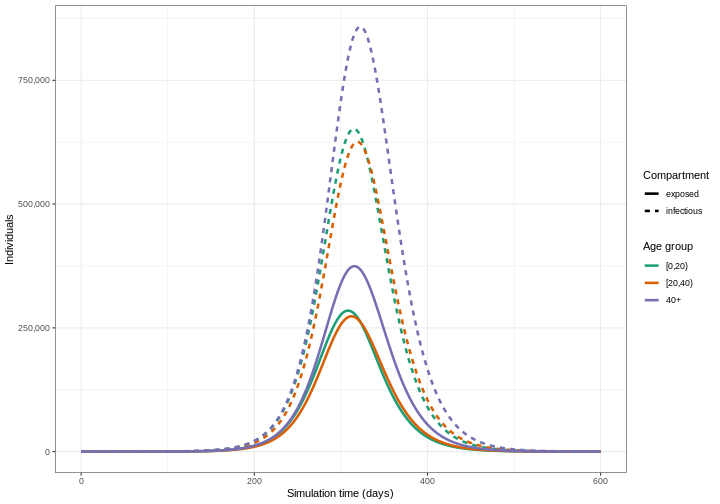
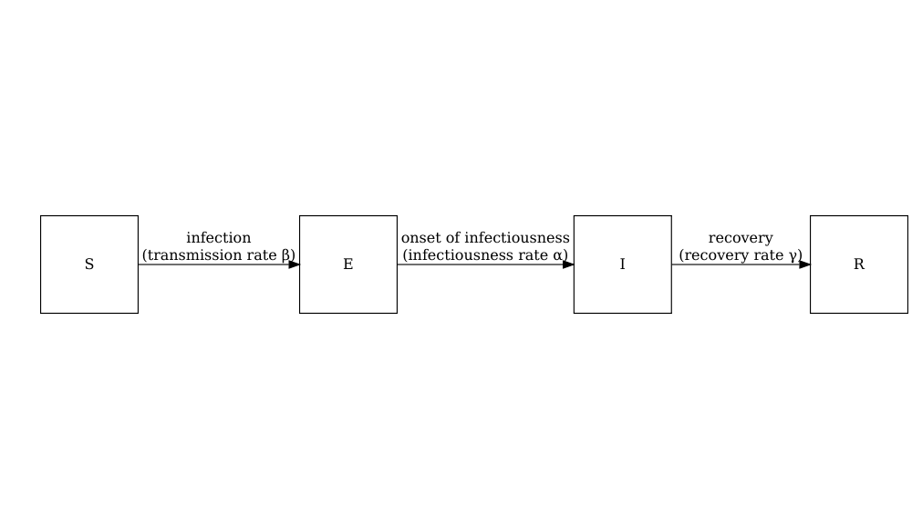
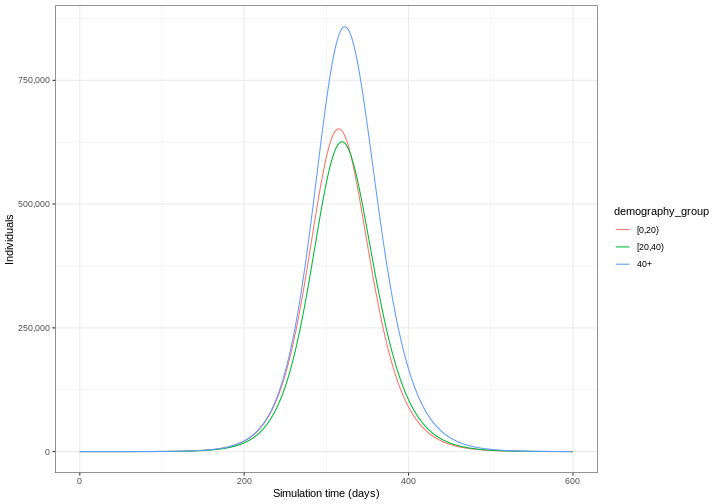
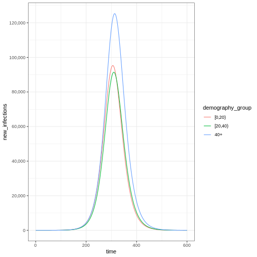
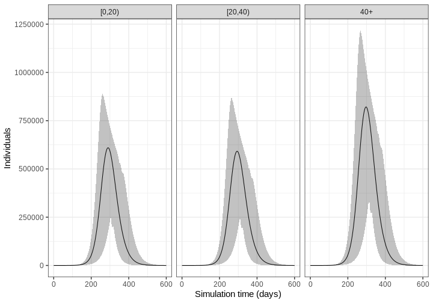

:::::::::::::::::::::::::::::::::::::: questions 

- How do I simulate disease spread using a mathematical model?
- What inputs are needed for a model simulation? 
- How do I account for uncertainty?

::::::::::::::::::::::::::::::::::::::::::::::::

::::::::::::::::::::::::::::::::::::: objectives

- Load an existing model structure from `{epidemics}` R package
- Load an existing social contact matrix with `{socialmixr}`
- Generate a disease spread model simulation with `{epidemics}`
- Generate multiple model simulations and visualise uncertainty 

::::::::::::::::::::::::::::::::::::::::::::::::

::::::::::::::::::::::::::::::::::::: prereq

Learners should familiarise themselves with following concept dependencies before working through this tutorial: 

**Mathematical Modelling** : [Introduction to infectious disease models](https://doi.org/10.1038/s41592-020-0856-2), [state variables](../learners/reference.md#state), [model parameters](../learners/reference.md#parsode), [initial conditions](../learners/reference.md#initial), [differential equations](../learners/reference.md#ordinary).

**Epidemic theory** : [Transmission](https://doi.org/10.1155/2011/267049), [Reproduction number](https://doi.org/10.3201/eid2501.171901).
:::::::::::::::::::::::::::::::::


## Introduction

Mathematical models are useful tools for generating future trajectories of disease spread. In this tutorial, we will use the R package `{epidemics}` to generate disease trajectories of an influenza strain with pandemic potential. By the end of this tutorial, you will be able to generate the trajectory below showing the number of infectious individuals in different age categories over time.

In this tutorial we are going to learn how to use the `{epidemics}` package to simulate disease trajectories and access to social contact data with `{socialmixr}`. We'll use `{dplyr}`, `{ggplot2}` and the pipe `%>%` to connect some of their functions, so let's also call to the `{tidyverse}` package:


``` r
library(epidemics)
library(socialmixr)
library(tidyverse)
```





:::::::::::::::::::::::::::::::::::::::::::::::::::::::::::::::::::: instructor

By the end of this tutorial, learners should be able to replicate the above image on their own computers.

::::::::::::::::::::::::::::::::::::::::::::::::::::::::::::::::::::::::::::::::


## Simulating disease spread

To simulate infectious disease trajectories, we must first select a mathematical model to use.
There is a library of models to choose from in `{epidemics}`. These are prefixed with `model_*` and suffixed by the name of infection (e.g. `model_ebola` for Ebola) or a different identifier (e.g. `model_default`).

In this tutorial, we will use the default model in `{epidemics}`, called `model_default()`, which is designed to be an age-structured model that categorises individuals based on their infection status. For each age group $i$, individuals are categorized as either susceptible $S$, infected but not yet infectious $E$, infectious $I$ or recovered $R$. Next, we need to define the process by which individuals flow from one compartment to another. This can be done by defining a set of [differential equations](../learners/reference.md#ordinary) that specify how the number of individuals in each compartment changes over time.

The schematic below shows the processes which describe the flow of individuals between the disease states $S$, $E$, $I$ and $R$ and the key parameters for each process.





::::::::::::::::::::::::::::::::::::: callout
### Model parameters: rates

In population-level models defined by differential equations, model parameters are often (but not always) specified as rates. The rate at which an event occurs is the inverse of the average time until that event. For example, in the SEIR model, the recovery rate $\gamma$ is the inverse of the average infectious period.

Values of these rates can be determined from the natural history of the disease. For example,  if people are on average infectious for 8 days, then in the model, 1/8 of currently infectious people would recover each day (i.e. the rate of recovery, $\gamma=1/8=0.125$).


::::::::::::::::::::::::::::::::::::::::::::::::


For each disease state ($S$, $E$, $I$ and $R$) and age group ($i$), we have a differential equation describing the rate of change with respect to time.  

$$
\begin{aligned}
\frac{dS_i}{dt} & = - \beta S_i \sum_j C_{i,j} I_j/N_j \\
\frac{dE_i}{dt} &= \beta S_i\sum_j C_{i,j} I_j/N_j - \alpha E_i \\
\frac{dI_i}{dt} &= \alpha E_i - \gamma I_i \\
\frac{dR_i}{dt} &=\gamma I_i \\
\end{aligned}
$$

Individuals in age group ($i$) move from the susceptible state ($S_i$) to the exposed state ($E_i$) via age-specific contacts with infectious individuals in all groups $\beta S_i \sum_j C_{i,j} I_j/N_j$. The contact matrix $C$ allows for heterogeneity in contacts between age groups. They then move to the infectious state at a rate $\alpha$ and recover at a rate $\gamma$. Note that this model assumes no loss of immunity (there are no flows out of the recovered state), which may not be applicable for all diseases as some allow for reinfection.

The model parameters are:

- transmission rate $\beta$ (derived from the basic reproduction number $R_0$ and the recovery rate $\gamma$),
- [contact matrix](../learners/reference.md#contact) $C$ containing the frequency of contacts between age groups (a square $i \times j$ matrix),
- infectiousness rate  $\alpha$ (pre-infectious period, or [latent period](../learners/reference.md#latent) =$1/\alpha$), and
- recovery rate $\gamma$ (infectious period = $1/\gamma$).


::::::::::::::::::::::::::::::::::::: callout
### Exposed, infected, infectious

Confusion sometimes arises when referring to the terms 'exposed', 'infected' and 'infectious' in mathematical modelling. Infection occurs after a person has been exposed, but in modelling terms individuals that are 'exposed' are treated as already infected. 

We will use the following definitions for our state variables:

+ $E$ = Exposed : infected **but not yet** infectious,
+ $I$ = Infectious: infected **and** infectious.
::::::::::::::::::::::::::::::::::::::::::::::::


To generate trajectories using our model, we must prepare the following inputs:  

1.  Contact matrix 
2.  Initial conditions 
3.  Population structure
4.  Model parameters

### 1. Contact matrix

A contact matrix represents the average number of contacts between individuals in different age groups. It is a crucial component in age-structured models as it captures how different age groups interact and potentially transmit infections. We will use the R package `{socialmixr}` to load a contact matrix estimated from POLYMOD survey data [(Mossong et al. 2008)](https://doi.org/10.1371/journal.pmed.0050074).


::::::::::::::::::::::::::::::::::::: challenge 

## Load contact and population data

Using the R package `socialmixr`, run the following lines of R code to obtain the contact matrix for the United Kingdom for the year age bins:

+ age between 0 and 20 years,
+ age between 20 and 40,
+ 40 years and over.

```r
polymod <- socialmixr::polymod
contact_data <- socialmixr::contact_matrix(
  survey = polymod,
  countries = "United Kingdom",
  age.limits = c(0, 20, 40),
  symmetric = TRUE
)
# prepare contact matrix
contact_matrix <- t(contact_data$matrix)
contact_matrix
```

:::::::::::::::::::::::: solution 
 

``` output
                 age.group
contact.age.group   [0,20)  [20,40)      40+
          [0,20)  7.883663 2.794154 1.565665
          [20,40) 3.120220 4.854839 2.624868
          40+     3.063895 4.599893 5.005571
```


:::::::::::::::::::::::::::::::::
::::::::::::::::::::::::::::::::::::::::::::::::

The result is a square matrix with rows and columns for each age group. Contact matrices can be loaded from other sources, but they must be formatted as a matrix to be used in `epidemics`.

::::::::::::::::::::::::::::::::::::: callout

### Normalisation

In `{epidemics}` the contact matrix normalisation happens within the function call, so we don't need to normalise the contact matrix before we pass it to `population()` (see section 3. Population Structure). For details on normalisation, see the tutorial on [Contact matrices](../episodes/contact-matrices.md).

::::::::::::::::::::::::::::::::::::::::::::::::

### 2. Initial conditions

The initial conditions are the proportion of individuals in each disease state $S$, $E$, $I$ and $R$ for each age group at time 0. In this example, we have three age groups age between 0 and 20 years, age between 20 and 40 years and over. Let's assume that in the youngest age category, one in a million individuals are infectious, and the remaining age categories are infection free. 

The initial conditions in the first age category are $S(0)=1-\frac{1}{1,000,000}$, $E(0) =0$, $I(0)=\frac{1}{1,000,000}$, $R(0)=0$. This is specified as a vector as follows:


``` r
initial_i <- 1e-6
initial_conditions_inf <- c(
  S = 1 - initial_i, E = 0, I = initial_i, R = 0, V = 0
)
```

For the age categories that are free from infection, the initial conditions are $S(0)=1$, $E(0) =0$, $I(0)=0$, $R(0)=0$. We specify this as follows,


``` r
initial_conditions_free <- c(
  S = 1, E = 0, I = 0, R = 0, V = 0
)
```

We combine the three initial conditions vectors into one matrix, 


``` r
# combine the initial conditions
initial_conditions <- rbind(
  initial_conditions_inf, # age group 1
  initial_conditions_free, # age group 2
  initial_conditions_free # age group 3
)

# use contact matrix to assign age group names
rownames(initial_conditions) <- rownames(contact_matrix)
initial_conditions
```

``` output
               S E     I R V
[0,20)  0.999999 0 1e-06 0 0
[20,40) 1.000000 0 0e+00 0 0
40+     1.000000 0 0e+00 0 0
```


### 3. Population structure
The population object requires a vector containing the demographic structure of the population. The demographic vector must be a named vector containing the number of individuals in each age group of our given population. In this example, we can extract the demographic information from the `contact_data` object that we obtained using the `socialmixr` package.


``` r
demography_vector <- contact_data$demography$population
names(demography_vector) <- rownames(contact_matrix)
demography_vector
```

``` output
  [0,20)  [20,40)      40+ 
14799290 16526302 28961159 
```

To create our population object, from the `{epidemics}` package we call the function `population()` specifying a name, the contact matrix, the demography vector and the initial conditions.


``` r
library(epidemics)

uk_population <- population(
  name = "UK",
  contact_matrix = contact_matrix,
  demography_vector = demography_vector,
  initial_conditions = initial_conditions
)
```


### 4. Model parameters

To run our model we need to specify the model parameters: 

- transmission rate $\beta$,
- infectiousness rate $\alpha$ (preinfectious period=$1/\alpha$),
- recovery rate $\gamma$ (infectious period=$1/\gamma$).

In `epidemics`, we specify the model inputs as :

- `transmission_rate` $\beta = R_0 \gamma$,
- `infectiousness_rate` = $\alpha$,
- `recovery_rate` = $\gamma$, 
  
We will simulate a strain of influenza with pandemic potential with $R_0=1.46$, with a pre-infectious period of 3 days and infectious period of 7 days. Therefore our inputs will be:


``` r
# time periods
preinfectious_period <- 3.0
infectious_period <- 7.0
basic_reproduction <- 1.46
```


``` r
# rates
infectiousness_rate <- 1.0 / preinfectious_period
recovery_rate <- 1.0 / infectious_period
transmission_rate <- basic_reproduction / infectious_period
```

::::::::::::::::::::::::::::::::::::: callout
### The basic reproduction number $R_0$
The basic reproduction number, $R_0$, for the SEIR model is: 

$$ R_0 = \frac{\beta}{\gamma}.$$ 

Therefore, we can rewrite transmission rate $\beta$ as:

$$ \beta = R_0 \gamma.$$


::::::::::::::::::::::::::::::::::::::::::::::::


## Running the model

::::::::::::::::::::::::::::::::::::: callout
### Running (solving) the model

For models that are described by [differential equations](../learners/reference.md#ordinary), 'running' the model actually means to take the system of differential equations and 'solve' them to find out how the number of people in the underlying compartments change over time. Because differential equations describe the rate of change in the disease states with respect to time, rather than the number of individuals in each of these states, we typically need to use numerical methods to solve the equations.

An _ODE solver_ is the software used to find numerical solutions to differential equations. If interested on how a system of differential equations is solved in `{epidemics}`, we suggest you to read the section on [ODE systems and models](https://epiverse-trace.github.io/epidemics/articles/design-principles.html#ode-systems-and-models) at the "Design principles" vignette. 
::::::::::::::::::::::::::::::::::::::::::::::::

Now we are ready to run our model using `model_default()` from the `{epidemics}` package. 

Let's specify `time_end=600` to run the model for 600 days.

``` r
output <- model_default(
  # population
  population = uk_population,
  # rates
  transmission_rate = transmission_rate,
  infectiousness_rate = infectiousness_rate,
  recovery_rate = recovery_rate,
  # time
  time_end = 600, increment = 1.0
)
head(output)
```

``` output
    time demography_group compartment    value
   <num>           <char>      <char>    <num>
1:     0           [0,20) susceptible 14799275
2:     0          [20,40) susceptible 16526302
3:     0              40+ susceptible 28961159
4:     0           [0,20)     exposed        0
5:     0          [20,40)     exposed        0
6:     0              40+     exposed        0
```

*Note: This model also has the functionality to include vaccination and tracks the number of vaccinated individuals through time. Even though we have not specified any vaccination, there is still a vaccinated compartment in the output (containing no individuals). We will cover the use of vaccination in future tutorials.*

Our model output consists of the number of individuals in each compartment in each age group through time. We can visualise the infectious individuals only (those in the $I$ class) through time.


``` r
library(tidyverse)

output %>%
  filter(compartment == "infectious") %>%
  ggplot() +
  geom_line(
    aes(
      x = time,
      y = value,
      color = demography_group,
      linetype = compartment
    )
  ) +
  scale_y_continuous(
    labels = scales::comma
  ) +
  theme_bw() +
  labs(
    x = "Simulation time (days)",
    linetype = "Compartment",
    y = "Individuals"
  )
```




::::::::::::::::::::::::::::::::::::: callout
### Time increments

Note that there is a default argument of `increment = 1`. This relates to the time step of the ODE solver. When the parameters are specified on a daily time scale and the maximum number of time steps (`time_end`) is days, the default time step of the ODE solver is one day. 

The choice of increment will depend on the time scale of the parameters and the rate at which events can occur. In general, the increment should be smaller than the fastest event that can occur. For example: 

- If parameters are on a *daily* time scale, and all events are reported on a daily basis, then the increment should be equal to one day;
- If parameters are on a *monthly* time scale, but some events will occur within a month, then the increment should be less than one month.

::::::::::::::::::::::::::::::::::::::::::::::::

:::::::::::::::: testimonial

**Two helper functions in `{epidemics}`**

Use `epidemics::epidemic_peak()` to get the time and size of a compartment's highest peak for all demographic groups. By default, this will calculate for the infectious compartment.


``` r
epidemics::epidemic_peak(data = output)
```

``` output
   demography_group compartment  time    value
             <char>      <char> <num>    <num>
1:           [0,20)  infectious   315 651944.3
2:          [20,40)  infectious   319 625863.8
3:              40+  infectious   322 858259.1
```

Use `epidemics::epidemic_size()` to get the size of the epidemic at any stage between the start and the end. This is calculated as the number of individuals *recovered* from infection at that stage of the epidemic.


``` r
epidemics::epidemic_size(data = output)
```

``` output
[1]  9285873  9040679 12540088
```

These summary functions can help you get outputs relevant to scenario comparisons or any other downstream analysis.

::::::::::::::::

The figure above shows the total number or cumulative amount of individuals in the infectious compartment at each time.
If you want to show the *total burden* of the disease, the `infectious` compartment is the most appropriate.
On the other hand, if you want to show the *daily burden*, then you could use `epidemics::new_infections()` to get the daily incidence.

::::::::::::::::::::::: spoiler

Notice that the number of new infected individuals at each time (as in the figure below) is lower than the cumulative number of infectious individuals at each time (as in the figure above).


``` r
# New infections
newinfections_bygroup <- epidemics::new_infections(data = output)

# Visualise the spread of the epidemic in terms of new infections
newinfections_bygroup %>%
  ggplot(aes(x = time, y = new_infections, colour = demography_group)) +
  geom_line() +
  scale_y_continuous(
    breaks = scales::breaks_pretty(n = 5),
    labels = scales::comma
  ) +
  theme_bw()
```



:::::::::::::::::::::::

## Accounting for uncertainty

The epidemic model is [deterministic](../learners/reference.md#deterministic), which means it runs like clockwork: the same parameters will always lead to the same trajectory. A deterministic model is one where the outcome is completely determined by the initial conditions and parameters, with no random variation. However, reality is not so predictable. There are two main reasons for this: the transmission process can involve randomness, and we may not know the exact epidemiological characteristics of the pathogen we're interested in. In the next episode, we will consider 'stochastic' models (i.e. models where we can define the process that creates randomness in transmission). In the meantime, we can include uncertainty in the value of the parameters that go into the deterministic model. To account for this, we must run our model for different parameter combinations. 

We ran our model with $R_0= 1.5$. However, we believe that $R_0$ follows a normal distribution with mean 1.5 and standard deviation 0.05. To account for uncertainty, we will run the model for different values of $R_0$. The steps we will follow to do this are:

1. Obtain 100 samples from a normal distribution


``` r
# specify the mean and standard deviation of R0
r_estimate_mean <- 1.5
r_estimate_sd <- 0.05

# Generate 100 R samples
r_samples <- withr::with_seed(
  seed = 1,
  rnorm(
    n = 100, mean = r_estimate_mean, sd = r_estimate_sd
  )
)

infectious_period <- 7
beta <- r_samples / infectious_period
```

2. Run the model 100 times with $R_0$ equal to a different sample each time


``` r
output_samples <- model_default(
  population = uk_population,
  transmission_rate = beta,
  infectiousness_rate = infectiousness_rate,
  recovery_rate = recovery_rate,
  time_end = 600, increment = 1
)
```

3. Calculate the mean and 95% quantiles of the number of infectious individuals across each model simulation and visualise the output


``` r
output_samples %>%
  mutate(r_value = r_samples) %>%
  unnest(data) %>%
  filter(compartment == "infectious") %>%
  ggplot() +
  geom_line(
    aes(time, value, color = r_value, group = param_set),
    alpha = 3
  ) +
  scale_color_fermenter(
    palette = "RdBu",
    name = "R"
  ) +
  scale_y_continuous(
    labels = scales::comma
  ) +
  facet_grid(
    cols = vars(demography_group)
  ) +
  theme_bw() +
  labs(
    x = "Simulation time (days)",
    y = "Individuals"
  )
```




Deciding which parameters to include uncertainty in depends on a few factors: how well informed a parameter value is, e.g. consistency of estimates from the literature; how sensitive model outputs are to parameter value changes; and the purpose of the modelling task. See [McCabe et al. 2021](https://doi.org/10.1016%2Fj.epidem.2021.100520) to learn about different types of uncertainty in infectious disease modelling.

:::::::::::::::::: challenge

From the figure above: 

- How do the time and size of the epidemic peak for infectious individuals in each age group change as the basic reproduction number varies within its uncertainty range? Describe.

- Based on the definition of the basic reproduction number, are these changes expected? Explain briefly.

:::::::::: hint

To interpret the output based on location (time) and size of the peak infection, you can find a guide in this two-page paper introduction to Infectious Disease Modelling:

- Bjørnstad ON, Shea K, Krzywinski M, Altman N. 
**Modeling infectious epidemics.** 
Nat Methods. 2020 May;17(5):455-456. 
doi: 10.1038/s41592-020-0822-z. PMID: 32313223.
<https://www.nature.com/articles/s41592-020-0822-z>

::::::::::

::::::::::::::::::

## Summary 

In this tutorial, we have learnt how to simulate disease spread using a mathematical model. Once a model has been chosen, the parameters and other inputs must be specified in the correct way to perform model simulations. In the next tutorial, we will consider how to choose the right model for different tasks. 

::::::::::::::::::::::::::::::::::::: keypoints 

- Disease trajectories can be generated using the R package `epidemics`
- Uncertainty should be included in model trajectories using a range of model parameter values

::::::::::::::::::::::::::::::::::::::::::::::::
