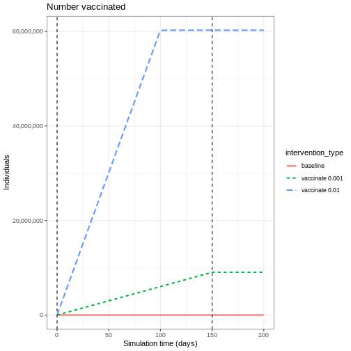
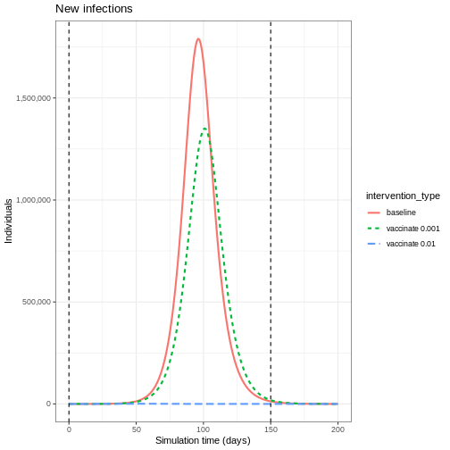
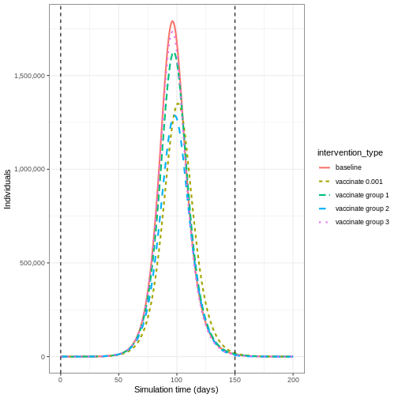
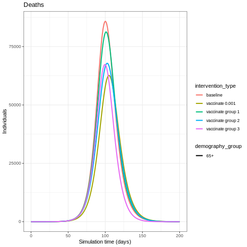
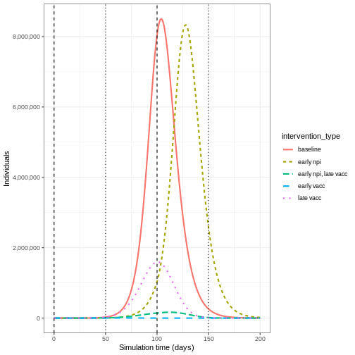
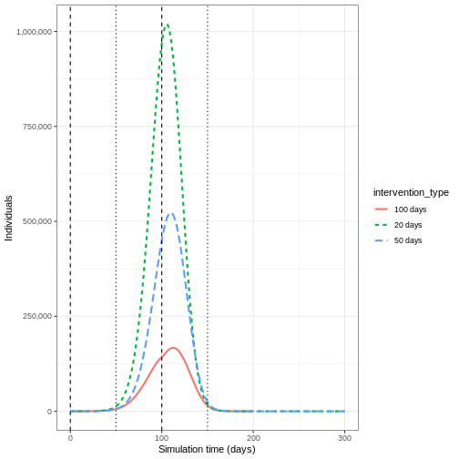

:::::::::::::::::::::::::::::::::::::: questions 

- What are the direct and indirect effects of vaccination?
- What are the benefits of targeted vaccination programs?
- What happens if we combine vaccination and NPIs?

::::::::::::::::::::::::::::::::::::::::::::::::

::::::::::::::::::::::::::::::::::::: objectives

- Understand the potential impact of vaccination programs
- Implement vaccination programs and NPI measures simultaneously using `{epidemics}`

::::::::::::::::::::::::::::::::::::::::::::::::

::::::::::::::::::::::::::::::::::::: prereq

+ Complete tutorials [Simulating transmission](../episodes/simulating-transmission.md), [Modelling interventions](../episodes/modelling-interventions.md) and [Comparing public health outcomes of interventions](../episodes/compare-interventions.md). 

Learners should familiarise themselves with following concept dependencies before working through this tutorial: 

**Outbreak response** : [Intervention types](https://www.cdc.gov/nonpharmaceutical-interventions/).
:::::::::::::::::::::::::::::::::


## Introduction

Vaccine programs can be used to help control epidemics via direct and indirect protection from infection. We can use mathematical models to make predictions about the potential impact of different vaccination strategies.   

Depending on how infections spread, targeting specific risk groups for vaccination may be a more effective strategy than vaccinating everyone. When vaccine programs are not immediately available to be rolled out, either from a capacity or development perspective, we may also want to know how non-pharmaceutical interventions (NPIs) can be used to control the epidemic in the meantime, as well as after a vaccine program has started. 

In this tutorial we will compare different vaccination strategies using models from `{epidemics}`. We will use the following R packages: 


``` r
library(ggplot2)
library(epidemics)
library(dplyr)
library(purrr)
```

## Key Terms

Before proceeding, let's define some important terms:

- **Herd immunity**: A form of indirect protection from infectious disease that occurs when a sufficient proportion of a population has become immune to an infection, thereby reducing the likelihood of infection for individuals who lack immunity.
- **Vaccination strategies**: Different approaches to administering vaccines, which may include targeting specific age groups or risk populations.
- **Non-pharmaceutical interventions (NPIs)**: Actions, apart from vaccines and treaments, that people and communities can take to help slow the spread of illnesses.

## Direct and indirect effects of vaccination

Vaccination programs using infection-blocking vaccines have two benefits:

1. Reducing individual risk of infection (**direct** effect of vaccination)
2. Reducing onward contribution to transmission (**indirect** effect of vaccination).

We will illustrate this using results from `model_default()` in `{epidemics}`. The `model_default()` function implements a standard SEIR (Susceptible-Exposed-Infected-Recovered) model with vaccination compartments. Using the contact matrix and parameters from the COVID-19 outbreak example in [Modelling interventions](../episodes/modelling-interventions.md) we will investigate the impact of two vaccination programs on the number of infections. For this hypothetical scenario, we will assume that vaccination programs start on day 0 and continue to be in place for 150 days. We will assume all age groups are vaccinated at the same rate in each program as follows:

+ vaccination program 01: vaccination rate 0.001
+ vaccination program 02: vaccination rate 0.01.


``` r
# prepare vaccination objects
vaccinate_01 <- epidemics::vaccination(
  name = "vaccinate all",
  time_begin = matrix(0, nrow(contact_matrix)),
  time_end = matrix(150, nrow(contact_matrix)),
  nu = matrix(c(0.001, 0.001, 0.001))
)

vaccinate_02 <- epidemics::vaccination(
  name = "vaccinate all",
  time_begin = matrix(0, nrow(contact_matrix)),
  time_end = matrix(150, nrow(contact_matrix)),
  nu = matrix(c(0.01, 0.01, 0.01))
)
```


We see the intuitive result that the higher the vaccination rate, the more people that are vaccinated. 


::: tab

### Output



### R Code


``` r
output_baseline <- epidemics::model_default(
  # population
  population = uk_population,
  # rate
  transmission_rate = transmission_rate,
  infectiousness_rate = infectiousness_rate,
  recovery_rate = recovery_rate,
  # time
  time_end = 200, increment = 1.0
)

output_vaccinate_01 <- epidemics::model_default(
  # population
  population = uk_population,
  # rate
  transmission_rate = transmission_rate,
  infectiousness_rate = infectiousness_rate,
  recovery_rate = recovery_rate,
  # intervention
  vaccination = vaccinate_01,
  # time
  time_end = 200, increment = 1.0
)

output_vaccinate_02 <- epidemics::model_default(
  # population
  population = uk_population,
  # rate
  transmission_rate = transmission_rate,
  infectiousness_rate = infectiousness_rate,
  recovery_rate = recovery_rate,
  # intervention
  vaccination = vaccinate_02,
  # time
  time_end = 200, increment = 1.0
)

# create intervention_type column for plotting
output_baseline$intervention_type <- "baseline"
output_vaccinate_01$intervention_type <- "vaccinate 0.001"
output_vaccinate_02$intervention_type <- "vaccinate 0.01"
output <- rbind(output_baseline, output_vaccinate_01, output_vaccinate_02)


output %>%
  filter(compartment == "vaccinated") %>%
  ggplot() +
  ggtitle("Number vaccinated") +
  aes(
    x = time,
    y = value,
    color = intervention_type,
    linetype = intervention_type
  ) +
  stat_summary(
    fun = "sum",
    geom = "line",
    linewidth = 1
  ) +
  scale_y_continuous(
    labels = scales::comma
  ) +
  geom_vline(
    xintercept = c(
      vaccinate_01$time_begin,
      vaccinate_01$time_end
    ),
    linetype = 2
  ) +
  theme_bw() +
  labs(
    x = "Simulation time (days)",
    y = "Individuals"
  )
```


:::

To understand the **indirect** effect of vaccinations, we want to know the effect that vaccination has on transmission, and hence the rate at new infections occur. We will use the function `new_infections()` in `{epidemics}` to calculate the number of new infections over time for the different vaccination programs. 

The inputs required are :

+ `data` : the model output,
+ `exclude_compartments` : this is an optional input, but in our case needed. We don't want the number of people vaccinated to be counted as new infections, so we need to specify the name of the model compartment where individuals transition out from `susceptible` (in this example `vaccinated`),
+ `by_group` : should the results be calculated for each demographic group separately. 


``` r
vaccinate_01_infections <- epidemics::new_infections(
  output_vaccinate_01,
  exclude_compartments = "vaccinated",
  by_group = FALSE
)
```


::: tab

### Output 



### R code


``` r
# calculate new infections
baseline_infections <- epidemics::new_infections(
  output_baseline,
  exclude_compartments = "vaccinated",
  by_group = FALSE
)
vaccinate_01_infections <- epidemics::new_infections(
  output_vaccinate_01,
  exclude_compartments = "vaccinated",
  by_group = FALSE
)
vaccinate_02_infections <- epidemics::new_infections(
  output_vaccinate_02,
  exclude_compartments = "vaccinated",
  by_group = FALSE
)

# create intervention_type column for plotting
baseline_infections$intervention_type <- "baseline"
vaccinate_01_infections$intervention_type <- "vaccinate 0.001"
vaccinate_02_infections$intervention_type <- "vaccinate 0.01"
infections <- rbind(
  baseline_infections,
  vaccinate_01_infections,
  vaccinate_02_infections
)


infections %>%
  ggplot() +
  ggtitle("New infections") +
  geom_line(
    aes(
      time,
      new_infections,
      colour = intervention_type,
      linetype = intervention_type
    ),
    linewidth = 1
  ) +
  scale_y_continuous(
    labels = scales::comma
  ) +
  geom_vline(
    xintercept = c(
      vaccinate_01$time_begin,
      vaccinate_01$time_end
    ),
    linetype = 2
  ) +
  theme_bw() +
  labs(
    x = "Simulation time (days)",
    y = "Individuals"
  )
```

:::


We see that after accounting for the number of people vaccinated, there are fewer new infections when you have a higher vaccination rate. This is because there are fewer people susceptible to infection, and therefore fewer people who can become infected and contribute to onward infection. 

This **indirect** effect of vaccination programs is key to successfully controlling and eradicating infections. 


To evaluate the impact of vaccination programs, we often consider both the peak size, which indicates healthcare pressure at a single point in time, and the overall epidemic size, which refers to the cumulative number of infections.

We can find the cumulative sum using the R function `cumsum()` and use `purrr::map_dfr()` to loop over a list of new infection data frames. We can see the difference in infection numbers is by several orders of magnitude.


``` r
# create function that returns the intervention type and cumulative sum for
# given infections
find_cumsum <- function(infections) {
  return(data.frame(
    intervention_type = unique(infections$intervention_type),
    cumulative_sum = tail(cumsum(infections$new_infections), n = 1)
  ))
}

# create list of interventions
interventions <- tibble::lst(
  baseline_infections,
  vaccinate_01_infections,
  vaccinate_02_infections
)

# apply function to each data frame in the list
purrr::map_dfr(interventions, find_cumsum)
```

``` output
  intervention_type cumulative_sum
1          baseline    53478987.43
2   vaccinate 0.001    44803629.65
3    vaccinate 0.01       34550.52
```


::::::::::::::::::::::::::::::::::::: callout
## Herd immunity threshold

There exists a target threshold of vaccination based on the basic reproduction number $R_0$ to achieve [herd immunity](../learners/reference.md#herdimmunity).

The proportion of the population ($p$) that needs to be immune to achieve herd immunity is:

$$p = 1- \frac{1}{R_0}. $$

This formula is derived from the concept that when a sufficient proportion of the population is immune, each infected person will transmit the infection to fewer than one other person on average, leading to a decline in cases. For details of the mathematical derivation check out this [Plus Magazine article](https://plus.maths.org/content/maths-minute-r0-and-herd-immunity).

::::::::::::::::::::::::::::::::::::::::::::::::


## Targeted vaccination

For infections that have a higher burden in different risk groups, targeted vaccination programs can be utilised to control infection. For example, if there is heterogeneity in contacts by age, targeting different age groups for vaccination will result in different disease trajectories. 

We will use the same contact matrix as above from [Modelling interventions](../episodes/modelling-interventions.md):


``` r
contact_matrix
```

``` output
                 age.group
contact.age.group    [0,15)  [15,65)       65+
          [0,15)  6.8461538 1.655174 0.5892799
          [15,65) 6.0737213 9.169207 4.1223575
          65+     0.5258855 1.002545 1.7142857
```

There is higher levels of mixing within the 0-15 and 15-65 age groups than in the 65+ age group, so we expect that targeting different age groups will result in different disease trajectories. 

To show the effect of targeted vaccination, we will compare the following scenarios:

+ vaccinating all age groups at a rate 0.001,
+ vaccinating ages 0-15 only (group 1) at a rate 0.003,
+ vaccinating ages 15-65 only (group 2) at a rate 0.003,
+ vaccinating ages 65+ only (group 3) at a rate 0.003.


::: tab

### Output



### R Code


``` r
vaccinate_group_1 <- epidemics::vaccination(
  name = "vaccinate all",
  time_begin = matrix(40, nrow(contact_matrix)),
  time_end = matrix(40 + 150, nrow(contact_matrix)),
  nu = matrix(c(0.001 * 3, 0, 0))
)

vaccinate_group_2 <- epidemics::vaccination(
  name = "vaccinate all",
  time_begin = matrix(40, nrow(contact_matrix)),
  time_end = matrix(40 + 150, nrow(contact_matrix)),
  nu = matrix(c(0, 0.001 * 3, 0))
)

vaccinate_group_3 <- epidemics::vaccination(
  name = "vaccinate all",
  time_begin = matrix(40, nrow(contact_matrix)),
  time_end = matrix(40 + 150, nrow(contact_matrix)),
  nu = matrix(c(0, 0, 0.001 * 3))
)

output_vaccinate_group_1 <- epidemics::model_default(
  # population
  population = uk_population,
  # rate
  transmission_rate = transmission_rate,
  infectiousness_rate = infectiousness_rate,
  recovery_rate = recovery_rate,
  # intervention
  vaccination = vaccinate_group_1,
  # time
  time_end = 200,
  increment = 1.0
)

output_vaccinate_group_2 <- epidemics::model_default(
  # population
  population = uk_population,
  # rate
  transmission_rate = transmission_rate,
  infectiousness_rate = infectiousness_rate,
  recovery_rate = recovery_rate,
  # intervention
  vaccination = vaccinate_group_2,
  # time
  time_end = 200,
  increment = 1.0
)


output_vaccinate_group_3 <- epidemics::model_default(
  # population
  population = uk_population,
  # rate
  transmission_rate = transmission_rate,
  infectiousness_rate = infectiousness_rate,
  recovery_rate = recovery_rate,
  # intervention
  vaccination = vaccinate_group_3,
  # time
  time_end = 200,
  increment = 1.0
)

vaccinate_group_1_infections <- epidemics::new_infections(
  output_vaccinate_group_1,
  exclude_compartments = "vaccinated",
  by_group = FALSE
)
vaccinate_group_2_infections <- epidemics::new_infections(
  output_vaccinate_group_2,
  exclude_compartments = "vaccinated",
  by_group = FALSE
)
vaccinate_group_3_infections <- epidemics::new_infections(
  output_vaccinate_group_3,
  exclude_compartments = "vaccinated",
  by_group = FALSE
)

vaccinate_group_1_infections$intervention_type <- "vaccinate group 1"
vaccinate_group_2_infections$intervention_type <- "vaccinate group 2"
vaccinate_group_3_infections$intervention_type <- "vaccinate group 3"

output_infections <- rbind(
  baseline_infections,
  vaccinate_01_infections,
  vaccinate_group_1_infections,
  vaccinate_group_2_infections,
  vaccinate_group_3_infections
)


output_infections %>%
  ggplot() +
  geom_line(
    aes(
      time,
      new_infections,
      colour = intervention_type,
      linetype = intervention_type
    ),
    linewidth = 1
  ) +
  scale_y_continuous(
    labels = scales::comma
  ) +
  geom_vline(
    xintercept = c(
      vaccinate_01$time_begin,
      vaccinate_01$time_end
    ),
    linetype = 2
  ) +
  theme_bw() +
  labs(
    x = "Simulation time (days)",
    y = "Individuals"
  )
```


:::

Vaccinating group 3 only results in the highest epidemic peak size. Targeting group 2 results in the smallest epidemic peak size. Whereas targeting all age groups pushes the epidemic peak time later. As before, let's compare the cumulative number of infections under the different interventions:


``` r
interventions_targetted <- tibble::lst(
  baseline_infections,
  vaccinate_01_infections,
  vaccinate_group_1_infections,
  vaccinate_group_2_infections,
  vaccinate_group_3_infections
)

# apply function to each data frame in the list
purrr::map_dfr(interventions_targetted, find_cumsum)
```

``` output
  intervention_type cumulative_sum
1          baseline       53478987
2   vaccinate 0.001       44803630
3 vaccinate group 1       50436402
4 vaccinate group 2       42064335
5 vaccinate group 3       51638432
```

### Age-specific infection-fatality-risk 

Targeting specific age groups can reduce the number of deaths in the eldest age group. To illustrate this, we can define an age-specific infection-fatality-risk (IFR):


``` r
ifr <- c(0.00001, 0.001, 0.4)
names(ifr) <- rownames(contact_matrix)
```

To convert infections to deaths, we will need new infections by age group, so we call `new_infections()` with `by_group = TRUE` and then multiply the new infections by the IFR for that age group:


``` r
vaccinate_group_1_age <- epidemics::new_infections(
  output_vaccinate_group_1,
  exclude_compartments = "vaccinated",
  by_group = TRUE
)

vaccinate_group_1_deaths <-
  1:3 %>%
  purrr::map_dfr(
    function(x)
      vaccinate_group_1_age %>%
        filter(demography_group == names(ifr)[x]) %>%
        mutate(deaths = new_infections * ifr[x])
  )
```


Vaccinating all age groups has the greatest impact on deaths in the eldest age group (over 65 years of age), but we also see that vaccinating group 2 reduces the deaths in the eldest age group. Targeting younger groups can the number of deaths in the eldest age group (over 65 years of age).


``` r
baseline_deaths$intervention_type  <- "baseline"
vaccinate_01_deaths$intervention_type  <- "vaccinate 0.001"
vaccinate_group_1_deaths$intervention_type  <- "vaccinate group 1"
vaccinate_group_2_deaths$intervention_type  <- "vaccinate group 2"
vaccinate_group_3_deaths$intervention_type  <- "vaccinate group 3"

output_deaths <- rbind(baseline_deaths,
                       vaccinate_01_deaths,
                       vaccinate_group_1_deaths,
                       vaccinate_group_2_deaths,
                       vaccinate_group_3_deaths)

output_deaths %>%
  filter(demography_group == "65+") %>%
  ggplot() +
  ggtitle("Deaths") +
  geom_line(
            aes(time,
              deaths,
              colour = intervention_type,
              linetype = demography_group
            ),
            linewidth = 1) +
  theme_bw() +
  labs(
    x = "Simulation time (days)",
    y = "Individuals"
  )
```




## Vaccination versus NPIs

Modelling is a useful tool for understanding the potential impact of the timing and different combinations of control measures. In an outbreak scenario, vaccines can be used alongside other control measures. A recent study by [Barnsley et al. (2024)](https://doi.org/10.1016/S2214-109X(24)00286-9) used modelling to show the impact the COVID-19 vaccine could have had alongside NPIs if the vaccine had been developed within 100 days of the pathogen threat being recognised. We will use this study as inspiration to show the impact of a vaccine versus NPI implemented at different times. 

The NPI we will consider is temporarily closing schools, an intervention that has been used as a control measure for seasonal influenza [(Cowling et al. 2008)](https://doi.org/10.3201/eid1410.080646). Specifically, we will model a school closure that will reduce the contacts between school aged children (aged 0-15) by 0.5, and will cause a small reduction (0.01) in the contacts between adults (aged 15 and over). For the vaccine program, we assume an equal vaccination rate of 0.01 in each age group.

We define **early implementation** as the first day of the simulation  (i.e. when there are less than 100 infections in total), and **late implementation** as 50 days after the start of the simulation (i.e. when there are approximately 50,000 infections in total). We assume the control measures are in place for 100 days after they start. 

The combinations we will consider are :

+ early implementation of closing schools,
+ early implementation of a vaccine,
+ late implementation of a vaccine,
+ early implementation of closing schools and late implementation of a vaccine. 

The code below details how the interventions are simulated:  

``` r
early_start <- 0
late_start <- 50
duration <- 100
time_end <- 200

# close schools early
close_schools_early <- epidemics::intervention(
  name = "School closure",
  type = "contacts",
  time_begin = early_start,
  time_end = early_start + duration,
  reduction = matrix(c(0.5, 0.01, 0.01))
)

# vaccination late
vacc_late <- epidemics::vaccination(
  name = "vaccinate late",
  time_begin = matrix(late_start, nrow(contact_matrix)),
  time_end = matrix(late_start + duration, nrow(contact_matrix)),
  nu = matrix(c(0.01, 0.01, 0.01))
)

# npis started early + vaccination late
output_npi_early_vacc_late <- epidemics::model_default(
  population = uk_population,
  transmission_rate = transmission_rate,
  infectiousness_rate = infectiousness_rate,
  recovery_rate = recovery_rate,
  vaccination = vacc_late,
  intervention = list(contacts = close_schools_early),
  time_end = time_end, increment = 1.0
)
```


Early implementation of NPIs (`early npi`) delays the timing of the peak of infectious individuals but does not decrease the magnitude by much once the measure is lifted. Early implementation of the vaccine (`early vacc`) is the most effective control for reducing the peak number of infectious individuals, because it reduces the size of the susceptible group rather than just temporarily keeping infections away from it. Having an NPI in place before the vaccine is implemented (`early npi, late vacc`) is more effective than simply just implementing the vaccine late (`late vacc`).





::::::::::::::::::::::::::::::::::::: challenge 

## Lifting NPI measures

Investigate the impact lifting the  after implementing the vaccine. Adapt the code below to lift the NPI after 20, 50 and 100 days

:::::::::::::::::::::::: solution 

## Output

``` r
duration_20 <- 20
duration_50 <- 50

close_schools_early_20 <- epidemics::intervention(
  name = "School closure",
  type = "contacts",
  time_begin = early_start,
  time_end = early_start + duration_20,
  reduction = matrix(c(0.5, 0.01, 0.01))
)

close_schools_early_50 <- epidemics::intervention(
  name = "School closure",
  type = "contacts",
  time_begin = early_start,
  time_end = early_start + duration_50,
  reduction = matrix(c(0.5, 0.01, 0.01))
)

output_npi_early_vacc_late_20 <- epidemics::model_default(
  population = uk_population,
  transmission_rate = transmission_rate,
  infectiousness_rate = infectiousness_rate,
  recovery_rate = recovery_rate,
  vaccination = vacc_late,
  intervention = list(contacts = close_schools_early_20),
  time_end = 300, increment = 1.0
)

output_npi_early_vacc_late_50 <- epidemics::model_default(
  population = uk_population,
  transmission_rate = transmission_rate,
  infectiousness_rate = infectiousness_rate,
  recovery_rate = recovery_rate,
  vaccination = vacc_late,
  intervention = list(contacts = close_schools_early_50),
  time_end = 300, increment = 1.0
)

output_npi_early_vacc_late_20$intervention_type <- "20 days"
output_npi_early_vacc_late_50$intervention_type <- "50 days"
output_npi_early_vacc_late$intervention_type <- "100 days"

output_npis <- rbind(output_npi_early_vacc_late_20,
                     output_npi_early_vacc_late_50,
                     output_npi_early_vacc_late)

output_npis %>%
  filter(compartment == "infectious") %>%
  ggplot() +
  aes(
    x = time,
    y = value,
    color = intervention_type,
    linetype = intervention_type
  ) +
  stat_summary(
    fun = "sum",
    geom = "line",
    linewidth = 1
  ) +
  scale_y_continuous(
    labels = scales::comma
  ) +
  geom_vline(
    xintercept = c(
      early_start,
      early_start + duration
    ),
    linetype = 2
  ) +
  geom_vline(
    xintercept = c(
      late_start,
      late_start + duration
    ),
    linetype = 3
  ) +
  theme_bw() +
  labs(
    x = "Simulation time (days)",
    y = "Individuals"
  )
```




:::::::::::::::::::::::::::::::::
::::::::::::::::::::::::::::::::::::::::::::::::

## Summary

Using model generated disease trajectories we have investigated the potential impact of different vaccination strategies. When infection has group specific risk, targeted vaccination programs may be more effective in reducing epidemic peak. NPIs can be used alongside vaccine development to delay epidemic peaks before vaccines are readily available. 

We used a SEIR model with a vaccination class, but if we modelled immunity to infection
then we could investigate the impact of a vaccination program if it was implemented very late in the epidemic (i.e. after post-infection immunity had accumulated). See for example, [Baguelin et al. 2010](https://doi.org/10.1016/j.vaccine.2010.01.002)

In this tutorial we have investigated the potential effect of infection blocking vaccines, but we can use models to explore other effects of vaccines including imperfect vaccines. The disease trajectories generated in this tutorial can be used to calculate measures such as [DALYs](../learners/reference.md#dalys) averted as part of health economic analyses.


::::::::::::::::::::::::::::::::::::: keypoints 

- Herd immunity is a indirect effect of vaccination programs
- Targeted vaccination programs have benefits when there is heterogeneity in contacts
- The timing of implementation of vaccination programs and NPIs can result in very different disease trajectories

::::::::::::::::::::::::::::::::::::::::::::::::
